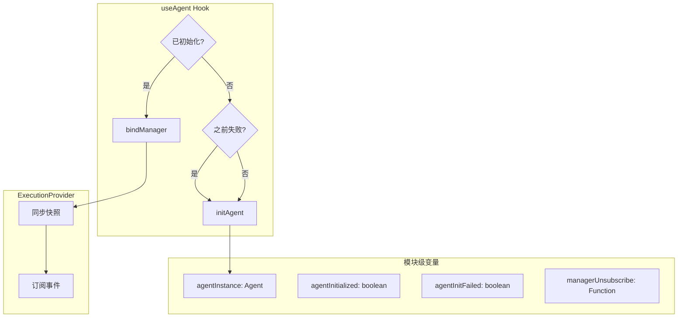

# 解决 Remount 时 Agent 执行中断问题（完善版）

## 问题回顾

`ctrl+o` 触发 `remountApp()` 导致：
1. `useAgent` 中的 `agentRef` 丢失 → Agent 引用断开
2. `execution.tsx` 中的 `managerRef` 丢失 → 事件订阅断开
3. 正在执行的 Agent 继续运行，但 UI 无法接收结果

## 解决方案：模块级变量持久化

### 架构图



## 修改文件

### 1. [packages/cli/src/hooks/useAgent.ts](packages/cli/src/hooks/useAgent.ts)

**变更内容**：

```typescript
// ==================== 模块级变量（跨 remount 持久化）====================
let agentInstance: Agent | null = null;
let agentInitialized = false;
let agentInitFailed = false;
let agentInitError: string | null = null;
let agentInitPromise: Promise<void> | null = null;
let currentModelInfo: { provider: string; model: string } | null = null;

export function useAgent(): UseAgentReturn {
  const [isReady, setIsReady] = useState(agentInitialized && agentInstance !== null);
  const [isLoading, setIsLoading] = useState(false);
  const [error, setError] = useState<string | null>(agentInitError);
  const [currentModel, setCurrentModel] = useState(currentModelInfo);
  const { bindManager } = useExecutionState();

  useEffect(() => {
    // 情况 1：已成功初始化，直接复用
    if (agentInitialized && agentInstance) {
      setIsReady(true);
      setCurrentModel(currentModelInfo);
      bindManager(agentInstance.getExecutionStream());
      return;
    }

    // 情况 2：之前失败过，自动重试
    if (agentInitFailed && !agentInstance) {
      agentInitFailed = false;
      agentInitError = null;
      agentInitPromise = initAgentInternal();
      return;
    }

    // 情况 3：正在初始化，等待完成
    if (agentInitPromise) {
      agentInitPromise.then(() => {
        if (agentInstance) {
          setIsReady(true);
          setCurrentModel(currentModelInfo);
          bindManager(agentInstance.getExecutionStream());
        } else if (agentInitError) {
          setError(agentInitError);
        }
      });
      return;
    }

    // 情况 4：首次初始化
    agentInitPromise = initAgentInternal();
  }, [bindManager]);

  // 内部初始化函数
  async function initAgentInternal(): Promise<void> {
    try {
      setIsLoading(true);
      // ... 原有初始化逻辑 ...
      
      agentInstance = agent;
      agentInitialized = true;
      agentInitFailed = false;
      currentModelInfo = { provider, model };
      
      setIsReady(true);
      setCurrentModel(currentModelInfo);
      bindManager(agent.getExecutionStream());
    } catch (err) {
      agentInitFailed = true;
      agentInitError = err.message;
      setError(err.message);
    } finally {
      setIsLoading(false);
      agentInitPromise = null;
    }
  }

  // sendMessage 使用 agentInstance 而非 agentRef.current
  const sendMessage = useCallback(async (message, options) => {
    if (!agentInstance || !isReady) return null;
    // ... 原有逻辑，将 agentRef.current 替换为 agentInstance ...
  }, [isReady, ...]);

  return { isReady, isLoading, error, sendMessage, switchModel, currentModel };
}
```

### 2. [packages/cli/src/context/execution.tsx](packages/cli/src/context/execution.tsx)

**变更内容**：

```typescript
// ==================== 模块级变量（跨 remount 持久化）====================
let managerInstance: ExecutionStreamManager | null = null;
let managerUnsubscribe: (() => void) | null = null;

export function ExecutionProvider({ children }: ExecutionProviderProps) {
  // ... 原有状态 ...

  // 绑定管理器（改进版）
  const bindManager = useCallback((manager: ExecutionStreamManager) => {
    // 1. 清理旧订阅（防止重复）
    if (managerUnsubscribe) {
      managerUnsubscribe();
      managerUnsubscribe = null;
    }

    // 2. 保存新 manager
    managerInstance = manager;

    // 3. 立即同步当前快照（关键！解决 remount 后状态不同步）
    const currentSnapshot = manager.getSnapshot();
    if (currentSnapshot) {
      setSnapshot(currentSnapshot);
      
      // 同步 isExecuting 状态
      const executing = 
        currentSnapshot.state !== 'idle' &&
        currentSnapshot.state !== 'completed' &&
        currentSnapshot.state !== 'error' &&
        currentSnapshot.state !== 'cancelled';
      setIsExecuting(executing);
    }

    // 4. 订阅新事件
    managerUnsubscribe = manager.on((event: ExecutionEvent) => {
      // ... 原有事件处理逻辑 ...
    });

    return managerUnsubscribe;
  }, []);

  // ... 其余代码不变 ...
}
```

## 关键改进点

| 改进 | 作用 | 解决的问题 |
|------|------|-----------|
| `managerUnsubscribe` 模块级 | 清理旧订阅 | 防止事件重复处理 |
| `bindManager` 中同步快照 | 立即恢复 UI 状态 | remount 后 UI 与 Agent 状态同步 |
| `agentInitFailed` 标记 | 自动重试失败的初始化 | 临时网络问题导致的初始化失败 |
| `agentInitPromise` | 防止并发初始化 | 多个组件同时调用 useAgent |

## 测试场景

1. **正常 remount**：Agent 空闲时按 ctrl+o，切换回来后 Agent 仍可用
2. **执行中 remount**：Agent 执行中按 ctrl+o，切换回来后继续显示执行状态
3. **初始化失败重试**：API Key 错误 → 修复后 → remount 自动重试
4. **快速连续 remount**：快速多次按 ctrl+o，不会重复初始化
