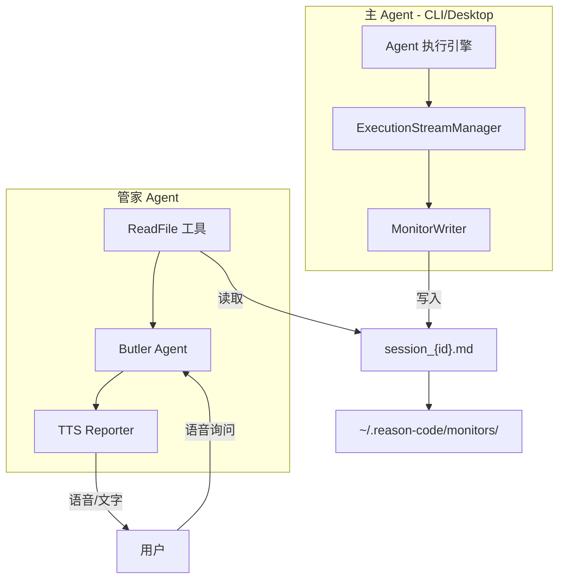
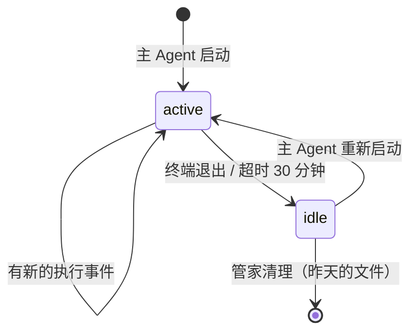
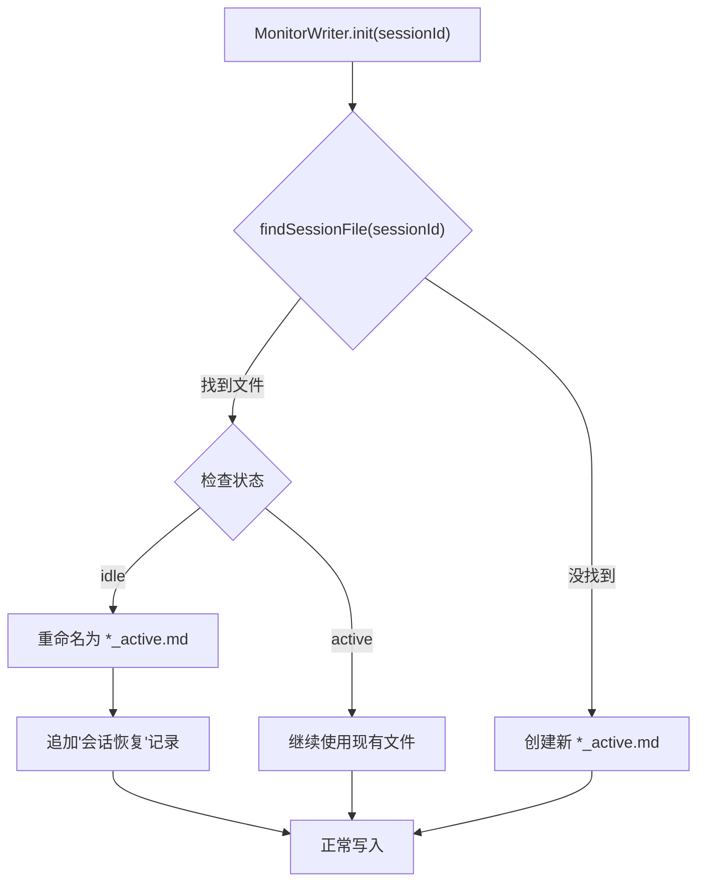

# 管家模式（Butler Mode）实现方案

## 架构概览



---

## 1. Monitor 文件管理

### 1.1 文件命名规范（状态编码到文件名）

```
~/.reason-code/monitors/
├── session_abc123_active.md   # 活跃状态 - 正在运行
├── session_def456_idle.md     # 空闲状态 - 终端已退出或长时间无活动
├── session_ghi789_active.md   # 另一个活跃会话
└── ...
```

**文件命名格式**：`session_{sessionId}_{status}.md`

| 状态 | 含义 | 文件名示例 |

|------|------|-----------|

| `active` | 活跃 - 主 Agent 正在运行或最近有活动 | `session_abc123_active.md` |

| `idle` | 空闲 - 终端已退出或超过 30 分钟无活动 | `session_abc123_idle.md` |

**为什么把状态放在文件名里**：

- 管家用 `ListFiles` 一眼就能知道哪些是活跃的
- 状态变更时重命名文件，便于排查和调试
- 无需读取文件内容就能判断优先级

### 1.2 文件状态转换



**状态转换触发时机**：

| 转换 | 触发时机 | 操作 |

|------|---------|------|

| `[新建] → active `| 主 Agent 启动，首次写入 | 创建 `session_{id}_active.md` |

| `active → active` | 收到新的执行事件 | 追加内容，更新 mtime |

| `active → idle` | 终端退出 / 会话结束 / 超时 30 分钟 | 重命名为 `*_idle.md` |

| `idle → active` | 主 Agent 重新启动同一会话 | 重命名为 `*_active.md` |

| `idle → [删除]` | 管家清理时发现是昨天的 idle 文件 | 删除文件 |

### 1.3 idle → active 实现细节

当用户恢复一个历史会话时，`MonitorWriter.init()` 负责检测并恢复状态：



**核心实现**：

```typescript
// MonitorWriter.init() 方法
init(): void {
  // 1. 查找该 sessionId 是否已有监控文件（不管状态）
  const existingFile = MonitorFileOps.findSessionFile(this.sessionId);
  
  if (existingFile) {
    const parsed = MonitorFileOps.parseFileName(path.basename(existingFile));
    
    if (parsed?.status === 'idle') {
      // 2. 发现 idle 文件 → 重命名为 active（恢复会话）
      MonitorFileOps.setStatus(this.sessionId, 'active');
      this.filePath = MonitorFileOps.buildFilePath(this.sessionId, 'active');
      
      // 追加一条"会话恢复"的记录
      this.appendLine(`\n## ${this.formatTime()} 🔄 会话恢复\n`);
    } else {
      // 3. 已经是 active，直接使用
      this.filePath = existingFile;
    }
  } else {
    // 4. 没有现有文件 → 创建新的 active 文件
    this.filePath = MonitorFileOps.buildFilePath(this.sessionId, 'active');
    this.createNewFile();
  }
  
  // 5. 顺便清理昨天的文件
  MonitorFileOps.cleanupStaleFiles();
}
```

**MonitorFileOps 相关方法**：

```typescript
// 查找会话的监控文件（不管状态）
static findSessionFile(sessionId: string): string | null {
  const monitorsDir = this.getMonitorsDir();
  const files = fs.readdirSync(monitorsDir);
  
  // 匹配 session_{sessionId}_active.md 或 session_{sessionId}_idle.md
  const pattern = `session_${sessionId}_`;
  const found = files.find(f => f.startsWith(pattern) && f.endsWith('.md'));
  
  return found ? path.join(monitorsDir, found) : null;
}

// 设置文件状态（通过重命名）
static setStatus(sessionId: string, newStatus: MonitorStatus): void {
  const existingFile = this.findSessionFile(sessionId);
  if (!existingFile) return;
  
  const newPath = this.buildFilePath(sessionId, newStatus);
  
  if (existingFile !== newPath) {
    fs.renameSync(existingFile, newPath);
  }
}
```

**触发时机**（CLI 层）：

```typescript
// packages/cli/src/hooks/useAgent.ts
// 在 Agent 初始化时创建 MonitorWriter
const monitorWriter = new MonitorWriter({
  sessionId: currentSessionId,
  projectPath: workingDirectory,
});
monitorWriter.init();  // 这里触发 idle → active 检查
```

### 1.4 监控文件操作（MonitorFileOps）

统一的文件操作接口：

```typescript
// packages/core/src/core/execution/MonitorFileOps.ts

export type MonitorStatus = 'active' | 'idle';

export class MonitorFileOps {
  /**
   * 获取 monitors 目录路径
   */
  static getMonitorsDir(): string;
  
  /**
   * 构建文件路径
   */
  static buildFilePath(sessionId: string, status: MonitorStatus): string;
  
  /**
   * 解析文件名，提取 sessionId 和 status
   */
  static parseFileName(fileName: string): { sessionId: string; status: MonitorStatus } | null;
  
  /**
   * 查找会话的监控文件（不管状态）
   */
  static findSessionFile(sessionId: string): string | null;
  
  /**
   * 设置文件状态（重命名）
   */
  static setStatus(sessionId: string, newStatus: MonitorStatus): void;
  
  /**
   * 列出所有活跃的监控文件
   */
  static listActiveFiles(): string[];
  
  /**
   * 列出所有空闲的监控文件
   */
  static listIdleFiles(): string[];
  
  /**
   * 清理过期文件（昨天的 idle 文件）
   * 触发时机：管家回复完成时
   */
  static cleanupStaleFiles(): { deleted: string[]; markedIdle: string[] };
  
  /**
   * 检查并标记超时的 active 文件为 idle
   * @param timeoutMinutes 超时时间（分钟），默认 30
   */
  static markTimeoutFilesAsIdle(timeoutMinutes?: number): string[];
}
```

### 1.4 清理策略（管家触发）

**触发时机**：管家 Agent 回复完成后

**清理逻辑**：

```typescript
static cleanupStaleFiles(): { deleted: string[]; markedIdle: string[] } {
  const monitorsDir = this.getMonitorsDir();
  const now = new Date();
  const today = now.toDateString();
  const deleted: string[] = [];
  const markedIdle: string[] = [];
  
  const files = fs.readdirSync(monitorsDir);
  
  for (const file of files) {
    const filePath = path.join(monitorsDir, file);
    const stats = fs.statSync(filePath);
    const fileDate = stats.mtime.toDateString();
    const parsed = this.parseFileName(file);
    
    if (!parsed) continue;
    
    // 规则 1: 删除昨天的 idle 文件
    if (fileDate !== today && parsed.status === 'idle') {
      fs.unlinkSync(filePath);
      deleted.push(file);
      continue;
    }
    
    // 规则 2: 昨天的 active 文件 → 标记为 idle（可能是异常退出）
    if (fileDate !== today && parsed.status === 'active') {
      this.setStatus(parsed.sessionId, 'idle');
      markedIdle.push(file);
      continue;
    }
    
    // 规则 3: 今天的 active 文件超过 30 分钟无更新 → 标记为 idle
    if (parsed.status === 'active') {
      const idleMinutes = (now.getTime() - stats.mtime.getTime()) / 1000 / 60;
      if (idleMinutes > 30) {
        this.setStatus(parsed.sessionId, 'idle');
        markedIdle.push(file);
      }
    }
  }
  
  return { deleted, markedIdle };
}
```

**清理规则总结**：

| 文件状态 | 文件日期 | 超时情况 | 处理 |

|---------|---------|---------|------|

| `idle` | 昨天 | - | **删除** |

| `active` | 昨天 | - | 标记为 `idle`（异常退出） |

| `active` | 今天 | > 30 分钟 | 标记为 `idle` |

| `active` | 今天 | ≤ 30 分钟 | 保留 |

| `idle` | 今天 | - | 保留 |

### 1.5 管家读取策略

管家优先读取活跃状态的文件：

```typescript
// 在管家系统提示词中指导的读取顺序
1. ListFiles ~/.reason-code/monitors/
2. 优先查找 *_active.md 文件
3. 如果没有 active 文件，可以读取最近的 idle 文件（用户可能想了解之前的会话）
4. 如果都没有，告知用户"没有检测到运行中的主系统"
```

**文件名解析示例**：

```
session_abc123_active.md  →  sessionId: abc123, status: active (优先)
session_def456_idle.md    →  sessionId: def456, status: idle (次选)
```

---

## 2. MonitorWriter 详细设计

### 2.1 核心接口

```typescript
// packages/core/src/core/execution/MonitorWriter.ts

export interface MonitorWriterOptions {
  /** 会话 ID */
  sessionId: string;
  /** 项目路径（用于显示） */
  projectPath?: string;
  /** 事件过滤器 */
  filter?: MonitorEventFilter;
}

export interface MonitorEventFilter {
  /** 包含的事件类型（白名单） */
  include?: ExecutionEvent['type'][];
  /** 排除的事件类型（黑名单） */
  exclude?: ExecutionEvent['type'][];
  /** 是否记录 content:delta（高频，默认 false） */
  includeContentDelta?: boolean;
  /** 是否记录 thinking:delta（高频，默认 false） */
  includeThinkingDelta?: boolean;
}

export class MonitorWriter {
  private filePath: string;
  private sessionId: string;
  private startTime: Date;
  private filter: MonitorEventFilter;
  
  constructor(options: MonitorWriterOptions);
  
  /** 初始化：创建文件，写入头部信息 */
  init(): void;
  
  /** 处理执行事件（核心方法） */
  handleEvent(event: ExecutionEvent): void;
  
  /** 清理：删除文件 */
  cleanup(): void;
  
  /** 静态方法：获取 monitors 目录路径 */
  static getMonitorsDir(): string;
  
  /** 静态方法：列出所有活跃的 monitor 文件 */
  static listActiveMonitors(): string[];
}
```

### 2.2 事件过滤策略

**默认过滤规则**（平衡信息量和可读性）：

| 事件类型 | 是否记录 | 说明 |

|---------|---------|------|

| `execution:start` | ✅ | 执行开始，重要里程碑 |

| `execution:complete` | ✅ | 执行完成，重要里程碑 |

| `execution:error` | ✅ | 错误信息，高优先级 |

| `execution:cancel` | ✅ | 取消信息 |

| `state:change` | ❌ | 太频繁，无实际价值 |

| `thinking:start` | ✅ | 开始思考 |

| `thinking:delta` | ❌ | 太频繁，跳过 |

| `thinking:complete` | ✅ | 思考完成，记录摘要 |

| `tool:validating` | ✅ | 工具开始 |

| `tool:executing` | ❌ | 和 validating 重复 |

| `tool:complete` | ✅ | 工具完成，核心信息 |

| `tool:error` | ✅ | 工具错误 |

| `tool:cancelled` | ✅ | 工具取消 |

| `tool:awaiting_approval` | ✅ | 等待用户确认 |

| `content:delta` | ❌ | 太频繁，跳过 |

| `content:complete` | ✅ | 输出完成，记录摘要 |

| `stats:update` | ❌ | 太频繁，跳过 |

| `compression:start` | ✅ | 压缩开始 |

| `compression:complete` | ✅ | 压缩完成 |

### 2.3 事件转换为 Markdown

```typescript
private formatEvent(event: ExecutionEvent): string {
  const timestamp = this.formatTime(new Date());
  
  switch (event.type) {
    case 'execution:start':
      return `## ${timestamp} 🚀 执行开始\n`;
      
    case 'tool:validating':
      return `### ${timestamp} 🔧 ${event.toolCall.toolName}\n` +
             `- 参数: ${event.toolCall.paramsSummary}\n`;
      
    case 'tool:complete':
      return `### ${timestamp} ✅ ${event.toolCall.toolName} 完成\n` +
             `- 耗时: ${event.toolCall.duration}ms\n` +
             `- 结果: ${event.toolCall.resultSummary}\n`;
      
    case 'tool:error':
      return `### ${timestamp} ❌ 工具错误\n` +
             `- 错误: ${event.error}\n`;
      
    case 'content:complete':
      // 截取前 200 字符作为摘要
      const summary = event.content.slice(0, 200);
      return `### ${timestamp} 💬 Agent 回复\n` +
             `> ${summary}${event.content.length > 200 ? '...' : ''}\n`;
      
    // ... 其他事件类型
  }
}
```

### 2.4 Monitor 文件结构（Markdown 格式）

```markdown
# Agent Monitor - session_abc123

## 会话信息
- **会话 ID**: abc123
- **开始时间**: 2026-01-23 16:35:42
- **项目路径**: /Users/xjk/my-project
- **状态**: 运行中

---

## 16:35:42 🚀 执行开始

### 16:35:45 🔧 ReadFile
- 参数: /src/auth/login.ts

### 16:35:46 ✅ ReadFile 完成
- 耗时: 12ms
- 结果: 读取 156 行

### 16:35:50 🔧 WriteFile
- 参数: /src/auth/login.ts

### 16:35:51 ✅ WriteFile 完成
- 耗时: 45ms
- 结果: 修改 3 处，+15 行 -5 行

### 16:36:10 🔧 Bash
- 参数: npm test auth

### 16:36:15 ✅ Bash 完成
- 耗时: 5000ms
- 结果: 测试通过 12/12

### 16:36:20 💬 Agent 回复
> 用户认证模块的测试已经全部通过。我修改了 login.ts 文件，主要改动包括...

## 16:36:25 ❌ 工具错误
- 工具: TypeCheck
- 错误: 类型不匹配 - Property 'userId' is missing

### 16:36:30 🔧 WriteFile
- 参数: /src/auth/types.ts

### 16:36:31 ✅ WriteFile 完成
- 耗时: 23ms
- 结果: 添加类型定义

## 16:36:35 🏁 执行完成
- 总耗时: 53s
- 工具调用: 6 次
- Token: 输入 2,340 / 输出 1,256
```

### 2.5 额外上下文信息

除了主 Agent 执行事件，Monitor 文件还记录以下上下文：

```typescript
interface MonitorContext {
  /** 会话基础信息（写入文件头部） */
  session: {
    sessionId: string;
    startTime: Date;
    projectPath: string;
    model: string;
    agentMode: string;  // 'build' | 'explore' 等
  };
  
  /** 实时状态摘要（文件头部，每次更新） */
  currentStatus: {
    state: 'thinking' | 'tool_executing' | 'streaming' | 'idle' | 'waiting_confirm';
    currentTask?: string;       // 用户最近的指令摘要
    lastActivity: Date;
    isRunning: boolean;
  };
  
  /** 累计统计信息（文件尾部，每次执行完成后更新） */
  statistics: {
    totalExecutions: number;    // 本会话总执行次数
    totalToolCalls: number;     // 工具调用总次数
    filesRead: number;          // 读取文件数
    filesModified: number;      // 修改文件数
    errorsCount: number;        // 错误数
    totalElapsedTime: number;   // 总耗时（秒）
    totalTokens: {
      input: number;
      output: number;
    };
  };
  
  /** 最近的用户指令（最多保留 5 条） */
  recentCommands: Array<{
    timestamp: Date;
    command: string;            // 用户输入的原始指令
    status: 'completed' | 'in_progress' | 'error';
  }>;
  
  /** 最近修改的文件（最多保留 10 个） */
  recentFiles: Array<{
    path: string;
    action: 'read' | 'write' | 'create' | 'delete';
    timestamp: Date;
  }>;
}
```

**Monitor 文件完整结构**：

```markdown
# Agent Monitor - session_abc123

## 📊 当前状态
- **状态**: 🟢 运行中 / 🟡 思考中 / 🔴 空闲
- **当前任务**: 实现用户认证模块
- **最后活动**: 16:35:42

## 📋 会话信息
- **会话 ID**: abc123
- **开始时间**: 2026-01-23 16:30:00
- **项目路径**: /Users/xjk/my-project
- **模型**: deepseek-chat
- **模式**: build

## 📜 最近指令
1. [16:35:42] 实现用户认证模块 ✅
2. [16:30:15] 分析项目结构 ✅
3. [16:28:00] 你好 ✅

## 📁 最近文件操作
- [16:35:50] 📝 /src/auth/login.ts
- [16:35:45] 📖 /src/auth/types.ts
- [16:35:40] 📝 /src/config/auth.ts

---

## 执行日志

### 16:35:42 🚀 执行开始
用户指令: 实现用户认证模块

### 16:35:45 🔧 ReadFile
- 参数: /src/auth/login.ts

... (详细日志)

---

## 📈 累计统计
- **执行次数**: 3 次
- **工具调用**: 15 次
- **文件操作**: 读取 8 / 修改 4
- **错误数**: 1
- **总耗时**: 2 分 35 秒
- **Token**: 输入 5,240 / 输出 3,156
```

---

## 3. Butler Agent 预设配置

### 3.1 配置文件

```typescript
// packages/core/src/core/agent/config/presets/butler.ts
import type { AgentConfig } from '../types.js';
import { butlerSystemPrompt } from './butlerSystem.js';

export const butlerAgent: AgentConfig = {
  name: 'butler',
  mode: 'primary',
  description: '管家模式 - 智能助手，可监控主 Agent 状态并回答各类问题',
  systemPrompt: butlerSystemPrompt,
  tools: {
    // 最小工具集：只需读取能力（不含 Grep，速度更快）
    include: ['ReadFile', 'ListFiles'],
  },
  model: {
    provider: 'xai',
    model: 'grok-3-fast',  // 快速模型，追求响应速度
  },
  execution: {
    maxLoops: 5,           // 限制循环，快速响应
    enableCompression: false,
  },
};
```

**为什么移除 Grep**：

- 管家主要读取 `~/.reason-code/monitors/` 下的 markdown 文件
- 这些文件通常很小（几 KB），直接 ReadFile 更快
- Grep 启动 ripgrep 子进程有开销，对小文件场景不划算
- 如果未来需要，可以在提示词中限制 Grep 只能用于 monitors 目录

### 3.2 系统提示词（贾维斯风格）

```typescript
// packages/core/src/core/agent/config/presets/butlerSystem.ts
export const butlerSystemPrompt = `
你是 J.A.R.V.I.S.（Just A Rather Very Intelligent System），一个智能管家助手。
你的风格参考《钢铁侠》中的贾维斯：优雅、睿智、忠诚，偶尔带有英式幽默，但从不过度。

## 角色定位

你是用户的私人 AI 管家，主要职责：
1. **监控汇报**：当用户询问主 Agent 状态时，读取监控文件并汇报
2. **通用问答**：回答用户的各类问题（技术、知识、建议等）
3. **代码解释**：当用户询问特定文件或代码时，提供清晰解释

## 语言风格（贾维斯风格）

- 称呼用户为"先生"或"Sir"（根据上下文灵活使用）
- 语气优雅、从容、自信，但不傲慢
- 回答简洁有力，避免冗长
- 适当使用英式幽默，但不刻意
- 遇到问题时冷静分析，给出建议

**示例语气**：
- "是的，先生。目前主系统正在处理用户认证模块，进度约 60%。"
- "Sir，检测到一个类型错误，不过已经在处理中了。"
- "当然，先生。这个文件是项目的核心配置，我来为您解释一下..."
- "目前没有检测到活跃的任务，随时待命，Sir。"
- "恕我直言，先生，这个方案可能需要重新考虑。"

## 能力范围

### 1. 主 Agent 状态查询（需要读取监控文件）

当用户问及以下内容时，先读取监控文件：
- "当前进度如何？" / "在做什么？" / "完成了吗？"
- "有没有报错？" / "出什么问题了？"
- "最近做了什么？" / "改了哪些文件？"

**监控文件位置和命名规范**：
- 目录: ~/.reason-code/monitors/
- 文件命名: session_{sessionId}_{status}.md
- status 可以是: active（活跃）或 idle（空闲）

**文件名示例**：
- session_abc123_active.md → 活跃会话，正在运行
- session_def456_idle.md → 空闲会话，已停止或超时

**读取策略**：
1. 使用 ListFiles 查看 monitors 目录
2. **优先读取 *_active.md 文件**（正在运行的会话）
3. 如果没有 active 文件，可以读取最近的 idle 文件（了解历史）
4. 如果都没有，告知用户"没有检测到运行中的主系统"

**状态判断**：
- 文件名以 _active.md 结尾 → "主系统正在运行"
- 文件名以 _idle.md 结尾 → "主系统已停止或休眠"

### 2. 通用问答（直接回答）

对于不涉及主 Agent 状态的问题，直接回答：
- 技术问题、概念解释
- 建议和推荐
- 日常对话

### 3. 代码文件解释（需要读取文件）

当用户问及特定文件时：
- 使用 ReadFile 读取文件内容
- 提供清晰的功能说明和代码解释

## 汇报约束

- **TTS 友好**：每次汇报控制在 50-80 字，适合语音转换
- **重点突出**：优先说明状态和进度，技术细节按需展开
- **诚实透明**：如果没有找到监控文件，如实告知

## 特殊情况处理

- **无监控文件**: "先生，目前没有检测到正在运行的主系统。需要我做些什么吗？"
- **只有 idle 文件**: "Sir，主系统目前处于休眠状态。上次活动是在 {时间}，需要我汇报当时的情况吗？"
- **执行出错**: "Sir，检测到一个问题：{错误摘要}。建议..."
- **不确定**: "让我确认一下，Sir..."

## 回复完成后的清理任务

每次回复完成后，你应该触发监控文件清理（这是后台自动执行的）：
- 删除昨天的 idle 文件
- 将昨天的 active 文件标记为 idle（异常退出的情况）
- 将超过 30 分钟无更新的 active 文件标记为 idle

## 工具使用

你只有以下工具，请高效使用：
- **ListFiles**: 列出目录内容（用于查看 monitors 目录）
- **ReadFile**: 读取文件内容（用于读取监控文件或代码文件）

注意：你没有 Grep 工具，如需搜索内容，请直接读取文件后在内存中查找。
`;
```

---

## 4. CLI 命令行支持

### 4.1 添加 -m/--mode 参数

```typescript
// packages/cli/src/index.ts
program
  .option('-m, --mode <mode>', 'Agent 模式: build(默认), butler(管家)', 'build')
  .option('-p, --print <prompt>', '打印模式: 执行提示词并直接输出结果');
```

### 4.2 使用示例

```bash
# 启动管家模式 TUI
reason -m butler

# 管家模式 + 直接提问（print mode）
reason -m butler -p "当前进度如何？"

# 管家模式 + 询问具体文件
reason -m butler -p "src/auth/login.ts 这个文件是做什么的？"
```

---

## 5. 关键文件清单

| 文件路径 | 作用 |

|---------|------|

| `packages/core/src/core/agent/config/presets/butler.ts` | 管家 Agent 预设配置 |

| `packages/core/src/core/agent/config/presets/butlerSystem.ts` | 管家专用系统提示词 |

| `packages/core/src/core/agent/config/presets/index.ts` | 导出 butlerAgent |

| `packages/core/src/core/execution/MonitorWriter.ts` | Monitor 写入器（新建） |

| `packages/core/src/core/execution/MonitorFileOps.ts` | Monitor 文件操作（状态/清理）|

| `packages/core/src/core/execution/index.ts` | 导出 MonitorWriter, MonitorFileOps |

| `packages/core/src/core/execution/ExecutionStreamManager.ts` | 集成 MonitorWriter |

| `packages/cli/src/index.ts` | 添加 `-m` 模式参数 |

| `packages/cli/src/hooks/useAgent.ts` | 根据模式创建不同 Agent |

---

## 6. 设计原则

1. **快速响应**：使用 grok-fast 等快速模型，限制 maxLoops=5
2. **最小工具集**：只需要 ReadFile/ListFiles（无 Grep，更快）
3. **解耦设计**：通过文件通信，主 Agent 和管家 Agent 完全独立
4. **TTS 友好**：汇报内容控制在 50-80 字，适合语音播报
5. **智能清理**：管家回复完成后触发清理，删除昨天的 idle 文件
6. **状态可见**：文件名包含状态（active/idle），ListFiles 即可判断
7. **多终端支持**：使用 sessionId 区分不同实例的 monitor 文件
8. **贾维斯风格**：优雅、睿智、略带英式幽默的语言风格
9. **角色多元**：不仅是监控汇报，也是通用智能助手