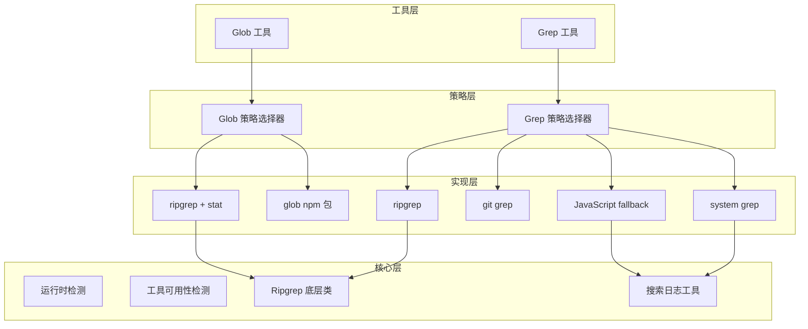

# Glob 和 Grep 本地文件搜索工具实现计划

## 架构概览




## 文件结构

```javascript
packages/core/src/
├── utils/
│   └── logUtils.ts              # 添加 searchLogger 错误抑制日志
└── core/tool/
    ├── Glob/
    │   ├── definitions.ts       # Glob 工具定义
    │   ├── executors.ts         # Glob 执行器
    │   ├── types.ts             # Glob 类型定义
    │   └── strategies/
    │       ├── index.ts         # 策略选择器
    │       ├── ripgrep-bun.ts   # ripgrep + Bun.stat 策略
    │       └── glob-npm.ts      # glob npm 包策略
    ├── Grep/
    │   ├── definitions.ts       # Grep 工具定义
    │   ├── executors.ts         # Grep 执行器
    │   ├── types.ts             # Grep 类型定义
    │   └── strategies/
    │       ├── index.ts         # 策略选择器
    │       ├── ripgrep.ts       # ripgrep 策略
    │       ├── git-grep.ts      # git grep 策略
    │       ├── system-grep.ts   # system grep 策略
    │       └── javascript.ts    # JavaScript fallback 策略
    └── utils/
        ├── runtime.ts           # 运行时环境检测
        ├── tool-detection.ts    # 工具可用性检测
        └── ripgrep.ts           # Ripgrep 底层类
```


## 实现步骤

### 第一阶段: 日志和基础设施

1. **在 `logUtils.ts` 添加 `searchLogger`** - 错误抑制日志记录

- `suppressed()`: 记录被抑制的错误 (ERROR 级别)
- `strategyFallback()`: 记录策略降级 (WARN 级别)
- `strategySelected()`: 记录策略选择 (DEBUG 级别)

2. **创建运行时检测工具** `utils/runtime.ts`

- `detectRuntime()`: 检测 Bun/Node.js 环境
- `isBun()`, `isNode()`: 便捷方法

3. **创建工具可用性检测** `utils/tool-detection.ts`

- `canUseRipgrep()`: 检测 ripgrep 是否可用
- `isGitRepository()`: 检测是否是 Git 仓库
- `canUseGitGrep()`: 检测 git 命令是否可用
- `canUseSystemGrep()`: 检测 grep 命令是否可用

4. **实现 Ripgrep 底层类** `utils/ripgrep.ts`

- 平台检测和下载 URL 构建
- 懒加载下载机制
- `filepath()`: 获取 ripgrep 路径
- `files()`: 文件列表生成器

### 第二阶段: Glob 工具

5. **Glob 类型定义** `Glob/types.ts`

- `GlobArgs`, `GlobResult`, `GlobStrategy` 枚举

6. **Glob npm 包策略** `Glob/strategies/glob-npm.ts`

- 使用 glob npm 包
- 智能排序 (24小时优先)
- 符号链接安全控制 (`follow: false`)

7. **Glob ripgrep + stat 策略** `Glob/strategies/ripgrep-bun.ts`

- 使用 ripgrep 列出文件
- Bun.stat() 获取元数据
- 智能排序

8. **Glob 策略选择器** `Glob/strategies/index.ts`

- 根据环境选择最优策略

9. **Glob 执行器** `Glob/executors.ts`

- 统一执行入口
- 错误处理和降级

10. **Glob 工具定义** `Glob/definitions.ts`

                - 工具元数据和参数定义

### 第三阶段: Grep 工具

11. **Grep 类型定义** `Grep/types.ts`

                - `GrepArgs`, `GrepResult`, `GrepMatch`, `GrepStrategy` 枚举

12. **Grep ripgrep 策略** `Grep/strategies/ripgrep.ts`

                - 使用 ripgrep 搜索
                - 解析输出

13. **Grep git grep 策略** `Grep/strategies/git-grep.ts`

                - 使用 git grep 搜索
                - 利用 git 索引

14. **Grep system grep 策略** `Grep/strategies/system-grep.ts`

                - 使用系统 grep 命令
                - 目录排除
                - 错误抑制 (权限错误)

15. **Grep JavaScript fallback 策略** `Grep/strategies/javascript.ts`

                - 使用 globStream 流式处理
                - 逐文件读取和匹配
                - 错误抑制 (权限错误、文件不存在)

16. **Grep 策略选择器** `Grep/strategies/index.ts`

                - 四层降级策略

17. **Grep 执行器** `Grep/executors.ts`

                - 统一执行入口
                - 策略失败自动降级

18. **Grep 工具定义** `Grep/definitions.ts`

                - 工具元数据和参数定义

### 第四阶段: 集成

19. **更新工具索引** `tool/index.ts`

                - 导出 Glob 和 Grep 工具

20. **在 ToolManager 中注册**

                - 添加 Glob 和 Grep 到默认工具列表

## 关键实现细节

### searchLogger 错误抑制日志 (logUtils.ts)

```typescript
export const searchLogger = {
  /**
            * 记录被抑制的错误
            * ERROR: 错误详情（记录到日志但不中断执行）
   */
  suppressed(
    strategy: string,
    filePath: string,
    errorCode: string,
    errorMessage: string
  ) {
    logger.error(`🔇 [Search:Suppressed] ${strategy}`, {
      filePath,
      errorCode,
      errorMessage,
      reason: 'error_suppressed_to_continue_search',
    });
  },

  /**
            * 记录策略降级
            * WARN: 降级原因
   */
  strategyFallback(
    fromStrategy: string,
    toStrategy: string,
    reason: string
  ) {
    logger.warn(`⬇️ [Search:Fallback] ${fromStrategy} → ${toStrategy}`, {
      reason,
    });
  },

  /**
            * 记录策略选择
            * DEBUG: 选择的策略
   */
  strategySelected(tool: string, strategy: string, runtime: string) {
    logger.debug(`🎯 [Search:Strategy] ${tool}`, {
      strategy,
      runtime,
    });
  },
};
```


### 智能排序实现

```typescript
const RECENT_THRESHOLD = 24 * 60 * 60 * 1000; // 24小时

function sortByRecentFirst(files: GlobResult[]): void {
  const now = Date.now();
  files.sort((a, b) => {
    const aRecent = (now - a.mtime) < RECENT_THRESHOLD;
    const bRecent = (now - b.mtime) < RECENT_THRESHOLD;
    if (aRecent && !bRecent) return -1;
    if (!aRecent && bRecent) return 1;
    return b.mtime - a.mtime;
  });
}
```


### 错误抑制实现 (使用 searchLogger)

```typescript
try {
  const content = await fs.readFile(filePath, 'utf8');
  // 搜索处理...
} catch (error: unknown) {
  if (isNodeError(error)) {
    // 记录被抑制的错误
    searchLogger.suppressed(
      'javascript',
      filePath,
      error.code || 'UNKNOWN',
      error.message
    );
    
    // 权限错误或文件不存在，跳过继续
    if (error.code === 'EACCES' || error.code === 'ENOENT') {
      continue;
    }
  }
}
```


## 依赖项

需要安装的 npm 包:

- `glob`: 文件名模式匹配 (已有或需安装)