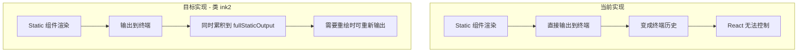
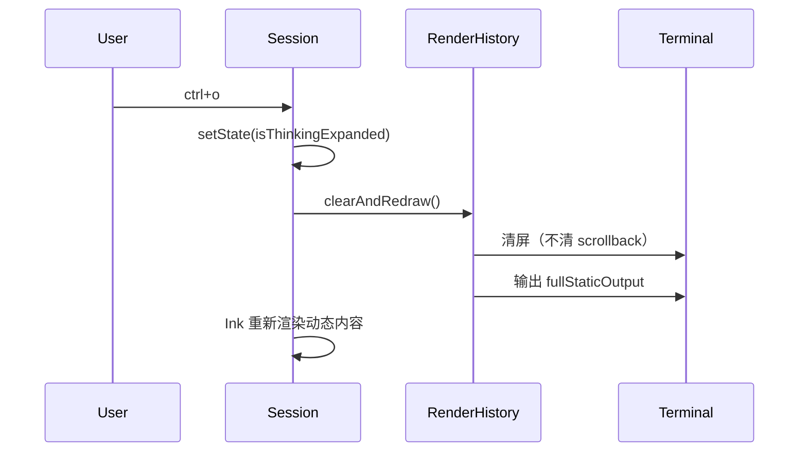

# 类 ink2 渲染机制实现：保留 Static 组件 + 自管理输出历史

## 背景

Claude Code 使用 `ink2` 渲染模式，其核心机制是：

```javascript
┌─────────────────────────────────────────────────────────────┐
│  Claude Code 的 ink2 渲染策略                                │
│                                                              │
│  1. 保留 Static 组件（通过 internal_static 标记）            │
│                                                              │
│  2. fullStaticOutput: 累积所有 Static 输出的文本              │
│     - 每次 Static 输出时，追加到 fullStaticOutput             │
│                                                              │
│  3. 需要重绘时（如 ctrl+o 切换、屏幕变化）：                   │
│     a. 清除当前屏幕（不清除 scrollback）                      │
│     b. 重新输出 fullStaticOutput（所有历史 Static 内容）      │
│     c. 渲染动态内容                                           │
│                                                              │
│  4. skipStaticElements 参数：                                 │
│     - 正常渲染时跳过 Static（因为已经在 fullStaticOutput 中）  │
│     - 需要时可以重新渲染                                      │
└─────────────────────────────────────────────────────────────┘
```

---

## 核心设计

### 1. 渲染历史管理器

创建一个管理器来累积所有 Static 输出，类似 Claude Code 的 `fullStaticOutput`：

```typescript
// packages/cli/src/util/renderHistory.ts

class RenderHistoryManager {
  private fullStaticOutput: string = '';
  
  // 累积 Static 输出（每次 Static 组件渲染时调用）
  appendStaticOutput(content: string): void {
    this.fullStaticOutput += content;
  }
  
  // 获取完整历史
  getFullStaticOutput(): string {
    return this.fullStaticOutput;
  }
  
  // 清屏并重新输出所有历史（ctrl+o 切换时调用）
  clearAndRedraw(): void {
    // 1. 清除当前屏幕（不清 scrollback）
    process.stdout.write('\x1b[2J\x1b[H');
    
    // 2. 重新输出所有 Static 历史
    process.stdout.write(this.fullStaticOutput);
  }
  
  // 重置（新会话时）
  reset(): void {
    this.fullStaticOutput = '';
  }
}

export const renderHistory = new RenderHistoryManager();
```


### 2. 保留 Static 组件 + 拦截输出

关键改变：保留 `Static` 组件，但拦截其输出并累积到 `renderHistory`：




### 3. ctrl+o 切换机制



---

## 修改清单

### 文件 1: [packages/cli/src/util/renderHistory.ts](packages/cli/src/util/renderHistory.ts) (新建)

渲染历史管理器，核心功能：

- `appendStaticOutput(content)`: 累积 Static 输出
- `clearAndRedraw()`: 清屏 + 重新输出历史
- `reset()`: 重置（新会话）

### 文件 2: [packages/cli/src/app.tsx](packages/cli/src/app.tsx)

| 删除 | 说明 ||------|------|| `inAlternateScreen` 变量 | 不再使用备用屏幕 || `remountApp()` 函数 | 不再需要 remount || `persistedThinkingExpanded` 相关 | 改用普通 React 状态 || 启动时的 `\x1b[?1049h` | 不进入备用屏幕 || 退出时的 `\x1b[?1049l` | 不退出备用屏幕 || `clearTerminal()` 中的 `\x1b[3J` | 保留 scrollback || 新增 | 说明 ||------|------|| 导出 `triggerRedraw()` 函数 | 供 execution.tsx 调用，触发清屏重绘 |

### 文件 3: [packages/cli/src/context/execution.tsx](packages/cli/src/context/execution.tsx)

| 删除 | 说明 ||------|------|| `import { remountApp, ... }` | 不再需要 || `managerUnsubscribe` 模块变量 | 不再需要跨 remount 持久化 || 修改 | 说明 ||------|------|| `toggleThinkingExpanded` | 改为：setState + 调用 `renderHistory.clearAndRedraw()` |

### 文件 4: [packages/cli/src/routes/session/index.tsx](packages/cli/src/routes/session/index.tsx)

| 保留 | 说明 ||------|------|| `<Static>` 组件 | 继续使用 Static 组件 || 新增 | 说明 ||------|------|| 拦截 Static 输出 | 使用 `useEffect` 或自定义渲染逻辑，将 Static 输出累积到 renderHistory |---

## 实现难点与解决方案

### 难点 1：如何拦截 Static 组件的输出？

Ink 的 `Static` 组件输出后直接写入 stdout，我们需要拦截这个输出。**解决方案**：使用 `process.stdout.write` 的 monkey-patch 或 Ink 的 `onRender` 回调：

```typescript
// 方案 A：在 app.tsx 中拦截 stdout
const originalWrite = process.stdout.write.bind(process.stdout);
process.stdout.write = (chunk: any, ...args: any[]) => {
  // 累积到 renderHistory
  if (typeof chunk === 'string') {
    renderHistory.appendStaticOutput(chunk);
  }
  return originalWrite(chunk, ...args);
};
```


```typescript
// 方案 B：使用 Ink 的 patchConsole 或自定义 stdout
// 在 render() 时传入自定义 stdout
inkInstance = render(<Root />, {
  stdout: customStdout,  // 自定义 stdout 拦截
});
```


### 难点 2：如何区分 Static 输出和动态输出？

**解决方案**：

1. Static 输出只在新 item 加入时发生
2. 动态输出会被 Ink 清除并重绘
3. 我们只需要累积"不会被清除"的部分

---

## 实现步骤

1. **创建 renderHistory.ts** - 渲染历史管理器
2. **修改 app.tsx** - 移除备用屏幕，添加 stdout 拦截
3. **修改 execution.tsx** - 简化 toggleThinkingExpanded，调用 clearAndRedraw
4. **保留 session/index.tsx 的 Static 组件** - 不需要大改
5. **测试** - VSCode 和 iTerm2 中验证滚动和切换

---

## 预期效果