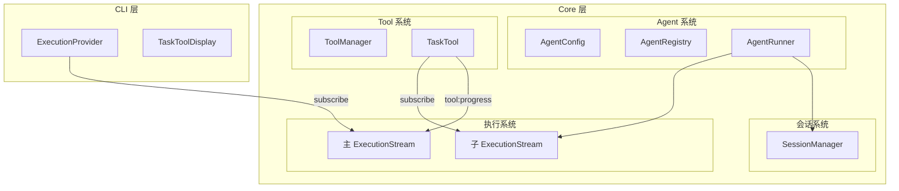
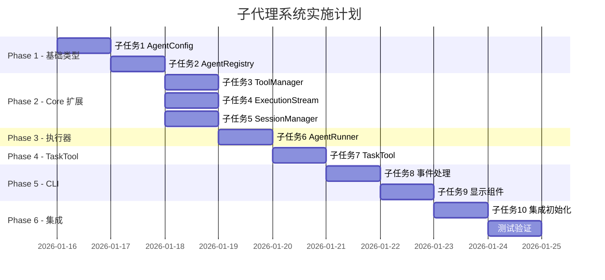

# reason-code 子代理系统完整实现方案

## 一、需求概述

### 1.1 目标

实现类似 Claude Code / OpenCode 的子代理系统，让主代理可以通过 `task` 工具调用专门的子代理（如 `explore`）来处理特定任务。

### 1.2 核心特性

- **配置驱动**：通过 AgentConfig 定义代理行为，AgentRunner 通用执行
- **工具隔离**：子代理只能使用受限的工具集，不能调用 `task`（防止递归）
- **会话隔离**：子代理使用独立的上下文，不污染主会话
- **实时显示**：子代理的工具调用过程实时显示在 CLI 中
- **会话持久化**：子会话也持久化到磁盘，支持查看历史

### 1.3 架构图



---

## 二、子任务分解

### 子任务 1：AgentConfig 类型系统

**目标**：定义代理配置的类型基础**文件**：

- `packages/core/src/core/agent/config/types.ts`
- `packages/core/src/core/agent/config/presets/build.ts`
- `packages/core/src/core/agent/config/presets/explore.ts`
- `packages/core/src/core/agent/config/presets/index.ts`
- `packages/core/src/core/agent/config/index.ts`

**类型定义**：

```typescript
// types.ts

/** 代理模式 */
export type AgentMode = 'primary' | 'subagent' | 'all';

/** 代理配置 */
export interface AgentConfig {
  /** 唯一标识 */
  name: string;
  
  /** 模式 */
  mode: AgentMode;
  
  /** 描述（用于 Task 工具说明） */
  description: string;
  
  /** 自定义系统提示词 */
  systemPrompt?: string;
  
  /** 工具配置：false = 禁用 */
  tools?: Record<string, boolean>;
  
  /** 模型配置（可选，覆盖默认） */
  model?: {
    provider: string;
    model: string;
  };
  
  /** 执行配置 */
  execution?: {
    maxLoops?: number;
    enableCompression?: boolean;
  };
  
  /** 是否隐藏（不在 UI 显示） */
  hidden?: boolean;
}
```

**预设配置**：

```typescript
// presets/build.ts - 主代理
export const buildAgent: AgentConfig = {
  name: 'build',
  mode: 'primary',
  description: 'General-purpose coding agent',
  // 使用默认系统提示词和所有工具
};

// presets/explore.ts - 子代理
export const exploreAgent: AgentConfig = {
  name: 'explore',
  mode: 'subagent',
  description: 'Fast agent for exploring codebases (read-only, search and analysis)',
  systemPrompt: `You are a code exploration specialist. Your role is to:
1. Quickly search and analyze codebases using glob and grep
2. Read relevant files to understand code structure
3. Summarize findings concisely

You have READ-ONLY access. Do not attempt to modify files.
Be efficient - use search tools to narrow down before reading files.
When done, provide a clear summary of your findings.`,
  tools: {
    write_file: false,
    todo_write: false,
  },
  execution: {
    maxLoops: 20,
    enableCompression: false,
  },
};
```

---

### 子任务 2：AgentRegistry 注册表

**目标**：集中管理所有代理配置**文件**：

- `packages/core/src/core/agent/registry.ts`

**实现**：

```typescript
// registry.ts

import { AgentConfig, AgentMode } from './config/types';
import { buildAgent, exploreAgent } from './config/presets';

export class AgentRegistry {
  private agents: Map<string, AgentConfig> = new Map();
  
  constructor() {
    this.registerBuiltinAgents();
  }
  
  /** 注册内置代理 */
  private registerBuiltinAgents(): void {
    this.register(buildAgent);
    this.register(exploreAgent);
  }
  
  /** 注册代理 */
  register(config: AgentConfig): void {
    this.agents.set(config.name, config);
  }
  
  /** 获取代理配置 */
  get(name: string): AgentConfig | undefined {
    return this.agents.get(name);
  }
  
  /** 获取所有代理 */
  getAll(): AgentConfig[] {
    return Array.from(this.agents.values());
  }
  
  /** 获取主代理列表（用于 UI 切换） */
  getPrimaryAgents(): AgentConfig[] {
    return this.getAll()
      .filter(a => a.mode === 'primary' || a.mode === 'all')
      .filter(a => !a.hidden);
  }
  
  /** 获取子代理列表（用于 Task 工具） */
  getSubAgents(): AgentConfig[] {
    return this.getAll()
      .filter(a => a.mode === 'subagent' || a.mode === 'all');
  }
}

// 单例导出
export const agentRegistry = new AgentRegistry();
```

---

### 子任务 3：ToolManager 扩展

**目标**：支持按代理配置过滤工具**文件**：

- `packages/core/src/core/tool/ToolManager.ts`（修改）

**新增方法**：

```typescript
// ToolManager.ts 新增

import { AgentConfig } from '../agent/config/types';

export class ToolManager {
  // ... 现有代码 ...
  
  /**
            * 注册单个工具（动态注册）
   */
  register(tool: InternalTool): void {
    this.tools.set(tool.name, tool);
  }
  
  /**
            * 获取指定代理可用的工具（过滤版）
            * @param agentConfig - 代理配置
            * @param excludeTask - 是否排除 task 工具（子代理必须排除）
   */
  getFilteredTools(agentConfig: AgentConfig, excludeTask = false): InternalTool[] {
    return this.getTools().filter(tool => {
      // 1. 子代理始终排除 task（防止递归）
      if (excludeTask && tool.name === 'task') return false;
      
      // 2. 检查代理配置中是否禁用
      if (agentConfig.tools?.[tool.name] === false) return false;
      
      return true;
    });
  }
  
  /**
            * 获取过滤后的 OpenAI 格式工具
   */
  getFormattedToolsFor(agentConfig: AgentConfig, excludeTask = false): OpenAITool[] {
    return this.getFilteredTools(agentConfig, excludeTask).map(tool => ({
      type: 'function' as const,
      function: {
        name: tool.name,
        description: tool.description,
        parameters: tool.parameters,
      },
    }));
  }
}
```

---

### 子任务 4：ExecutionStream 扩展

**目标**：新增 `tool:progress` 事件类型，支持子代理工具进度**文件**：

- `packages/core/src/core/execution/types.ts`（修改）
- `packages/core/src/core/execution/events.ts`（修改）
- `packages/core/src/core/execution/ExecutionStreamManager.ts`（修改）

**新增类型**：

```typescript
// types.ts 新增

/** 子代理工具进度类型 */
export type SubAgentProgressType = 'tool_start' | 'tool_complete' | 'thinking';

/** 子代理工具进度信息 */
export interface SubAgentProgress {
  type: SubAgentProgressType;
  /** 子工具调用 ID */
  subToolCallId: string;
  /** 工具名称 */
  toolName: string;
  /** 参数摘要 */
  paramsSummary?: string;
  /** 状态 */
  status: 'running' | 'completed' | 'error';
  /** 结果摘要（完成时） */
  resultSummary?: string;
  /** 错误信息 */
  error?: string;
}

/** 子代理工具摘要（用于显示） */
export interface SubAgentToolSummary {
  id: string;
  tool: string;
  status: 'running' | 'completed' | 'error';
  title?: string;
}
```

**新增事件**：

```typescript
// events.ts 新增

/** 工具进度事件（子代理专用） */
| {
    type: 'tool:progress';
    /** 父工具调用 ID（TaskTool 的 callId） */
    toolCallId: string;
    /** 子代理进度信息 */
    progress: SubAgentProgress;
  }
```

**ExecutionStreamManager 新增方法**：

```typescript
// ExecutionStreamManager.ts 新增

/**
    * 发送工具进度事件（用于 task 工具的子代理进度）
 */
emitToolProgress(toolCallId: string, progress: SubAgentProgress): void {
  this.emit({
    type: 'tool:progress',
    toolCallId,
    progress,
  });
}
```

---

### 子任务 5：SessionManager 会话管理

> **详细设计文档**：[SessionManager 会话管理完整方案](sessionmanager_会话管理_c5436a57.plan.md)**目标**：支持父子会话的创建、查询、持久化，并为未来用户自定义子代理做好扩展准备**设计要点**：

1. **会话管理在 CLI 层实现**（而非 Core 层），因为：

                                                                                                                                                                                                - 现有会话存储（`storage.ts`）已在 CLI 层
                                                                                                                                                                                                - Zustand Store 管理运行时状态
                                                                                                                                                                                                - CLI 负责 UI 过滤（主会话 vs 子会话）

2. **扩展现有 Session 类型**，而非新建：
```typescript
// packages/cli/src/context/store.tsx
export interface Session {
  id: string;
  title: string;
  createdAt: number;
  updatedAt: number;
  
  // 新增字段
  parentId?: string;      // 父会话 ID（子会话专用）
  agentName?: string;     // 使用的代理名称
  isSubSession?: boolean; // 是否为子会话（便于过滤）
}
```


3. **SessionManager 作为单例服务**：

**文件**：`packages/cli/src/services/SessionManager.ts`（新建）

```typescript
class SessionManagerImpl {
  /** 创建会话（主会话或子会话） */
  createSession(options: CreateSessionOptions = {}): Session;
  
  /** 获取会话 */
  getSession(sessionId: string): Session | null;
  
  /** 获取子会话列表 */
  getChildSessions(options: { parentId: string }): Session[];
  
  /** 复用或创建子会话（TaskTool 调用） */
  getOrCreateSubSession(options: {
    sessionId?: string;
    parentId: string;
    agentName: string;
    title?: string;
  }): Session;
  
  /** 列出所有主会话（过滤子会话） */
  listMainSessions(): Session[];
  
  /** 删除会话（包括其所有子会话） */
  deleteSessionWithChildren(sessionId: string): void;
}

export const SessionManager = new SessionManagerImpl();
```


4. **Zustand Store 扩展**：
```typescript
// 新增 updateSession 方法
updateSession: (id: string, updates: Partial<Session>) => void;
```


5. **会话层级关系**：
```javascript
MainSession (id: "main-001", parentId: undefined)
    │
    ├── SubSession 1 (parentId: "main-001", agent: "explore")
    ├── SubSession 2 (parentId: "main-001", agent: "general")
    └── SubSession 3 (parentId: "main-001", agent: "explore")
```


**未来扩展：用户自定义子代理**用户可在 `~/.reason-code/agents/` 目录下创建 JSON 配置文件定义自定义子代理：

```javascript
~/.reason-code/
├── config.json
└── agents/
    ├── researcher.json
    └── reviewer.json
```

详细实现方案请参阅 [SessionManager 会话管理完整方案](sessionmanager_会话管理_c5436a57.plan.md)---

### 子任务 6：AgentRunner 执行器

**目标**：通用代理执行器，支持主代理和子代理**文件**：

- `packages/core/src/core/agent/runner/types.ts`（新建）
- `packages/core/src/core/agent/runner/AgentRunner.ts`（新建）
- `packages/core/src/core/agent/runner/index.ts`（新建）

**类型定义**：

```typescript
// types.ts

import { AgentConfig } from '../config/types';
import { ExecutionStreamManager } from '../../execution';

/** AgentRunner 运行选项 */
export interface AgentRunnerOptions {
  /** 代理配置 */
  config: AgentConfig;
  /** 会话 ID */
  sessionId: string;
  /** 模型配置（可选，覆盖代理配置） */
  model?: { provider: string; model: string };
  /** 执行流管理器 */
  executionStream?: ExecutionStreamManager;
  /** 中断信号 */
  abortSignal?: AbortSignal;
  /** 是否为子代理（影响工具过滤） */
  isSubAgent?: boolean;
}

/** AgentRunner 运行结果 */
export interface AgentRunnerResult {
  success: boolean;
  result?: string;
  error?: string;
  loopCount: number;
}
```

**AgentRunner 实现**：

```typescript
// AgentRunner.ts

import { EventEmitter } from 'events';
import { AgentRunnerOptions, AgentRunnerResult } from './types';
import { ContextManager } from '../../context';
import { ToolManager } from '../../tool/ToolManager';
import { ToolLoopExecutor } from '../../llm/utils/executeToolLoop';
import { createLLMService } from '../../llm/factory';
import { buildSystemPrompt } from '../../promptManager';

export class AgentRunner extends EventEmitter {
  constructor(
    private toolManager: ToolManager,
    private defaultModel: { provider: string; model: string }
  ) {
    super();
  }
  
  async run(input: string, options: AgentRunnerOptions): Promise<AgentRunnerResult> {
    const { config, sessionId, executionStream, abortSignal, isSubAgent } = options;
    
    // 1. 创建独立的 ContextManager（上下文隔离）
    const contextManager = new ContextManager();
    
    // 2. 设置系统提示词
    const systemPrompt = config.systemPrompt || buildSystemPrompt({
      workingDirectory: process.cwd(),
      modelName: options.model?.model || this.defaultModel.model,
    });
    contextManager.setSystemPrompt(systemPrompt);
    contextManager.setUserInput(input);
    
    // 3. 创建 LLM 服务
    const model = options.model || config.model || this.defaultModel;
    const llmService = await createLLMService({
      provider: model.provider,
      model: model.model,
    });
    
    // 4. 获取过滤后的工具（子代理排除 task）
    const filteredTools = this.toolManager.getFilteredTools(config, isSubAgent);
    
    // 5. 创建临时 ToolManager（只包含允许的工具）
    const isolatedToolManager = new ToolManager();
    isolatedToolManager.clear();
    filteredTools.forEach(tool => isolatedToolManager.register(tool));
    
    // 6. 执行工具循环
    const executor = new ToolLoopExecutor(
      llmService,
      contextManager,
      isolatedToolManager,
      {
        maxLoops: config.execution?.maxLoops ?? 50,
        enableCompression: config.execution?.enableCompression ?? false,
        executionStream,
        abortSignal,
        sessionId,
      }
    );
    
    const result = await executor.run();
    
    return {
      success: result.success,
      result: result.result,
      error: result.error,
      loopCount: result.loopCount,
    };
  }
}
```

---

### 子任务 7：TaskTool 实现

**目标**：实现 task 工具，连接主代理和子代理**文件**：

- `packages/core/src/core/tool/Task/types.ts`（新建）
- `packages/core/src/core/tool/Task/definitions.ts`（新建）
- `packages/core/src/core/tool/Task/executors.ts`（新建）
- `packages/core/src/core/tool/Task/index.ts`（新建）

**类型定义**：

```typescript
// types.ts

import { SubAgentToolSummary } from '../../execution/types';

/** TaskTool 参数 */
export interface TaskParams {
  /** 任务描述（3-5 个词） */
  description: string;
  /** 详细任务说明 */
  prompt: string;
  /** 子代理类型 */
  subagent_type: string;
  /** 可选：继续之前的会话 */
  session_id?: string;
}

/** TaskTool 结果 */
export interface TaskResult {
  success: boolean;
  output: string;
  metadata: {
    agentName: string;
    sessionId: string;
    summary: SubAgentToolSummary[];
  };
}
```

**工具定义**：

```typescript
// definitions.ts

import { InternalTool } from '../types';
import { agentRegistry } from '../../agent/registry';
import { executeTask } from './executors';

/** 动态生成工具描述 */
function generateDescription(): string {
  const subAgents = agentRegistry.getSubAgents();
  const agentList = subAgents
    .map(a => `- ${a.name}: ${a.description}`)
    .join('\n');
  
  return `Launch a specialized sub-agent to handle complex tasks autonomously.

Available agents:
${agentList}

Usage notes:
1. Sub-agents run in isolated sessions with their own context
2. Each invocation creates a new session unless session_id is provided
3. Provide detailed task descriptions for best results
4. The agent's output is returned to you - summarize key findings for the user
5. Sub-agents cannot call other sub-agents (no nesting)`;
}

export const TaskTool: InternalTool = {
  name: 'task',
  category: 'agent',
  get description() {
    return generateDescription();
  },
  parameters: {
    type: 'object',
    properties: {
      description: {
        type: 'string',
        description: 'A short (3-5 words) description of the task',
      },
      prompt: {
        type: 'string',
        description: 'Detailed instructions for the sub-agent to perform',
      },
      subagent_type: {
        type: 'string',
        enum: agentRegistry.getSubAgents().map(a => a.name),
        description: 'The type of specialized agent to use',
      },
      session_id: {
        type: 'string',
        description: 'Optional: existing session ID to continue',
      },
    },
    required: ['description', 'prompt', 'subagent_type'],
  },
  handler: executeTask,
};
```

**执行器实现**：

```typescript
// executors.ts

import { TaskParams, TaskResult } from './types';
import { InternalToolContext } from '../types';
import { agentRegistry } from '../../agent/registry';
import { AgentRunner } from '../../agent/runner';
import { SessionManager } from '../../session';
import { ExecutionStreamManager, SubAgentToolSummary, SubAgentProgress } from '../../execution';
import { ToolManager } from '../ToolManager';

// 依赖注入（在初始化时设置）
let toolManager: ToolManager;
let sessionManager: SessionManager;
let defaultModel: { provider: string; model: string };

export function initTaskTool(deps: {
  toolManager: ToolManager;
  sessionManager: SessionManager;
  defaultModel: { provider: string; model: string };
}) {
  toolManager = deps.toolManager;
  sessionManager = deps.sessionManager;
  defaultModel = deps.defaultModel;
}

export async function executeTask(
  params: TaskParams,
  context?: InternalToolContext
): Promise<TaskResult> {
  // 1. 获取代理配置
  const agentConfig = agentRegistry.get(params.subagent_type);
  if (!agentConfig) {
    throw new Error(`Unknown agent type: ${params.subagent_type}`);
  }
  
  // 2. 创建或获取子会话
  const subSession = await sessionManager.create({
    title: `${params.description} (@${agentConfig.name})`,
    agentName: agentConfig.name,
    parentId: context?.sessionId,
  });
  
  // 3. 维护子代理工具调用列表
  const toolSummary: SubAgentToolSummary[] = [];
  
  // 4. 创建子代理的 ExecutionStream
  const subExecStream = new ExecutionStreamManager();
  
  // 5. 订阅子代理事件，转发为 tool:progress
  subExecStream.on((event) => {
    if (!context?.executionStream || !context?.callId) return;
    
    if (event.type === 'tool:validating') {
      // 子工具开始
      const progress: SubAgentProgress = {
        type: 'tool_start',
        subToolCallId: event.toolCall.id,
        toolName: event.toolCall.toolName,
        paramsSummary: event.toolCall.paramsSummary,
        status: 'running',
      };
      
      toolSummary.push({
        id: event.toolCall.id,
        tool: event.toolCall.toolName,
        status: 'running',
      });
      
      context.executionStream.emitToolProgress(context.callId, progress);
    }
    
    if (event.type === 'tool:complete') {
      // 子工具完成
      const progress: SubAgentProgress = {
        type: 'tool_complete',
        subToolCallId: event.toolCall.id,
        toolName: event.toolCall.toolName,
        status: event.toolCall.status === 'success' ? 'completed' : 'error',
        resultSummary: event.toolCall.resultSummary,
        error: event.toolCall.error,
      };
      
      // 更新 summary
      const item = toolSummary.find(t => t.id === event.toolCall.id);
      if (item) {
        item.status = progress.status;
        item.title = progress.resultSummary;
      }
      
      context.executionStream.emitToolProgress(context.callId, progress);
    }
  });
  
  // 6. 创建 AgentRunner 并执行
  const runner = new AgentRunner(toolManager, defaultModel);
  
  const result = await runner.run(params.prompt, {
    config: agentConfig,
    sessionId: subSession.id,
    executionStream: subExecStream,
    abortSignal: context?.abortSignal,
    isSubAgent: true,
  });
  
  // 7. 返回结果
  return {
    success: result.success,
    output: result.result || result.error || '',
    metadata: {
      agentName: agentConfig.name,
      sessionId: subSession.id,
      summary: toolSummary,
    },
  };
}
```

---

### 子任务 8：CLI 层事件处理

**目标**：处理 `tool:progress` 事件，更新工具显示**文件**：

- `packages/cli/src/hooks/useExecutionMessages.ts`（修改）
- `packages/cli/src/context/store.tsx`（修改，扩展 ToolCallInfo）

**Store 扩展**：

```typescript
// store.tsx 修改 ToolCallInfo

export interface ToolCallInfo {
  // ... 现有字段 ...
  
  /** 子代理工具调用摘要（仅 task 工具） */
  subAgentSummary?: Array<{
    id: string;
    tool: string;
    status: 'running' | 'completed' | 'error';
    title?: string;
  }>;
}
```

**事件处理**：

```typescript
// useExecutionMessages.ts 新增 case

case 'tool:progress': {
  const { toolCallId, progress } = event;
  
  // 找到对应的工具消息
  const toolMessageId = toolMessageMapRef.current.get(toolCallId);
  if (!toolMessageId) break;
  
  // 获取当前消息
  const messages = getStoreState().messages[sessionId] || [];
  const currentMessage = messages.find(m => m.id === toolMessageId);
  if (!currentMessage?.toolCall) break;
  
  const currentSummary = currentMessage.toolCall.subAgentSummary || [];
  let newSummary: typeof currentSummary;
  
  if (progress.type === 'tool_start') {
    // 添加新的子工具
    newSummary = [...currentSummary, {
      id: progress.subToolCallId,
      tool: progress.toolName,
      status: 'running',
    }];
  } else if (progress.type === 'tool_complete') {
    // 更新子工具状态
    newSummary = currentSummary.map(item =>
      item.id === progress.subToolCallId
        ? { ...item, status: progress.status, title: progress.resultSummary }
        : item
    );
  } else {
    break;
  }
  
  // 更新消息
  updateMessage(sessionId, toolMessageId, {
    toolCall: {
      subAgentSummary: newSummary,
    },
  });
  break;
}
```

---

### 子任务 9：CLI 层 TaskTool 显示组件

**目标**：实现 task 工具的专用显示组件**文件**：

- `packages/cli/src/component/message-area/task-tool-message.tsx`（新建）
- `packages/cli/src/component/message-area/tool-message.tsx`（修改）

**TaskToolMessage 组件**：

```tsx
// task-tool-message.tsx

import React from 'react';
import { Box, Text } from 'ink';
import { useTheme } from '../../context/theme';
import type { Message } from '../../context/store';

// Spinner 动画
const SPINNER_FRAMES = ['⠋', '⠙', '⠹', '⠸', '⠼', '⠴', '⠦', '⠧', '⠇', '⠏'];

function Spinner({ color }: { color: string }) {
  const [frame, setFrame] = React.useState(0);
  
  React.useEffect(() => {
    const timer = setInterval(() => {
      setFrame(f => (f + 1) % SPINNER_FRAMES.length);
    }, 80);
    return () => clearInterval(timer);
  }, []);
  
  return <Text color={color}>{SPINNER_FRAMES[frame]}</Text>;
}

interface TaskToolMessageProps {
  message: Message;
}

export function TaskToolMessage({ message }: TaskToolMessageProps) {
  const { colors } = useTheme();
  const { toolCall } = message;
  
  if (!toolCall) return null;
  
  const summary = toolCall.subAgentSummary || [];
  const MAX_DISPLAY = 5;
  const displayedItems = summary.slice(-MAX_DISPLAY); // 显示最新的
  const hiddenCount = Math.max(0, summary.length - MAX_DISPLAY);
  
  // 状态配置
  const statusConfig = {
    pending: { color: colors.warning, icon: '○' },
    executing: { color: colors.warning, icon: '◉' },
    success: { color: colors.success, icon: '●' },
    error: { color: colors.error, icon: '●' },
    cancelled: { color: colors.error, icon: '●' },
  };
  
  const config = statusConfig[toolCall.status] || statusConfig.pending;
  
  return (
    <Box flexDirection="column" paddingX={2}>
      {/* 主标题行 */}
      <Box>
        <Text color={config.color}>{config.icon} </Text>
        <Text color={colors.primary} bold>
          {toolCall.toolName}
        </Text>
        <Text color={colors.textMuted}> ({toolCall.paramsSummary})</Text>
      </Box>
      
      {/* 子代理工具调用列表 */}
      {summary.length > 0 && (
        <Box flexDirection="column" paddingLeft={2}>
          {/* 折叠提示（如果有隐藏项） */}
          {hiddenCount > 0 && (
            <Box>
              <Text color={colors.textMuted}>
                ├ ... +{hiddenCount} more tool uses
              </Text>
            </Box>
          )}
          
          {/* 显示的子工具 */}
          {displayedItems.map((item, index) => {
            const isLast = index === displayedItems.length - 1;
            const prefix = isLast ? '└' : '├';
            
            return (
              <Box key={item.id} flexDirection="row">
                <Text color={colors.textMuted}>{prefix} </Text>
                
                {/* 状态图标 */}
                {item.status === 'running' ? (
                  <Spinner color={colors.warning} />
                ) : item.status === 'error' ? (
                  <Text color={colors.error}>●</Text>
                ) : (
                  <Text color={colors.success}>●</Text>
                )}
                
                <Text color={colors.text}> {item.tool}</Text>
                
                {/* 结果摘要 */}
                {item.title && (
                  <Text color={colors.textMuted}> → {item.title}</Text>
                )}
              </Box>
            );
          })}
        </Box>
      )}
      
      {/* 最终结果（完成时） */}
      {toolCall.status === 'success' && toolCall.resultSummary && (
        <Box paddingLeft={2}>
          <Text color={colors.textMuted}>└ </Text>
          <Text color={colors.success}>{toolCall.resultSummary}</Text>
        </Box>
      )}
    </Box>
  );
}
```

**修改 tool-message.tsx**：

```tsx
// tool-message.tsx 修改

import { TaskToolMessage } from './task-tool-message';

export function ToolMessage({ message }: ToolMessageProps) {
  const { toolCall } = message;
  
  // task 工具使用专用组件
  if (toolCall?.toolName === 'task') {
    return <TaskToolMessage message={message} />;
  }
  
  // 其他工具使用现有逻辑
  // ... 现有代码 ...
}
```

---

### 子任务 10：集成与初始化

**目标**：将所有组件集成到现有系统**文件**：

- `packages/core/src/core/agent/index.ts`（修改）
- `packages/core/src/core/tool/ToolManager.ts`（修改，注册 TaskTool）
- `packages/core/src/core/index.ts`（修改，导出新模块）

**ToolManager 集成**：

```typescript
// ToolManager.ts 修改

import { TaskTool, initTaskTool } from './Task';
import { SessionManager } from '../session';

// 工具列表添加 TaskTool
const toolsList: InternalTool[] = [
  ListFilesTool,
  ReadFileTool,
  // ... 其他工具 ...
  TaskTool,  // 新增
];

// 初始化 TaskTool 依赖
export function initToolManager(deps: {
  sessionManager: SessionManager;
  defaultModel: { provider: string; model: string };
}) {
  const toolManager = new ToolManager();
  
  initTaskTool({
    toolManager,
    sessionManager: deps.sessionManager,
    defaultModel: deps.defaultModel,
  });
  
  return toolManager;
}
```

---

## 三、文件清单

### 新增文件

| 子任务 | 文件路径 ||--------|----------|| 1 | `core/agent/config/types.ts` || 1 | `core/agent/config/presets/build.ts` || 1 | `core/agent/config/presets/explore.ts` || 1 | `core/agent/config/presets/index.ts` || 1 | `core/agent/config/index.ts` || 2 | `core/agent/registry.ts` || 5 | `cli/src/services/SessionManager.ts` || 6 | `core/agent/runner/types.ts` || 6 | `core/agent/runner/AgentRunner.ts` || 6 | `core/agent/runner/index.ts` || 7 | `core/tool/Task/types.ts` || 7 | `core/tool/Task/definitions.ts` || 7 | `core/tool/Task/executors.ts` || 7 | `core/tool/Task/index.ts` || 9 | `cli/component/message-area/task-tool-message.tsx` |

### 修改文件

| 子任务 | 文件路径 ||--------|----------|| 3 | `core/tool/ToolManager.ts` || 4 | `core/execution/types.ts` || 4 | `core/execution/events.ts` || 4 | `core/execution/ExecutionStreamManager.ts` || 5 | `cli/src/context/store.tsx`（扩展 Session 类型，添加 updateSession）|| 8 | `cli/hooks/useExecutionMessages.ts` || 8 | `cli/context/store.tsx` || 9 | `cli/component/message-area/tool-message.tsx` || 10 | `core/agent/index.ts` || 10 | `core/index.ts` |---

## 四、实施顺序



---

## 五、测试要点

### 单元测试

1. **AgentRegistry**：注册、查询、过滤
2. **ToolManager.getFilteredTools**：工具过滤逻辑
3. **AgentRunner**：执行流程、上下文隔离
4. **TaskTool**：参数验证、事件转发

### 集成测试

1. **完整流程**：用户输入 → 主代理调用 task → 子代理执行 → 结果返回
2. **事件流**：验证 tool:progress 事件正确传递
3. **显示验证**：CLI 正确显示子代理工具进度