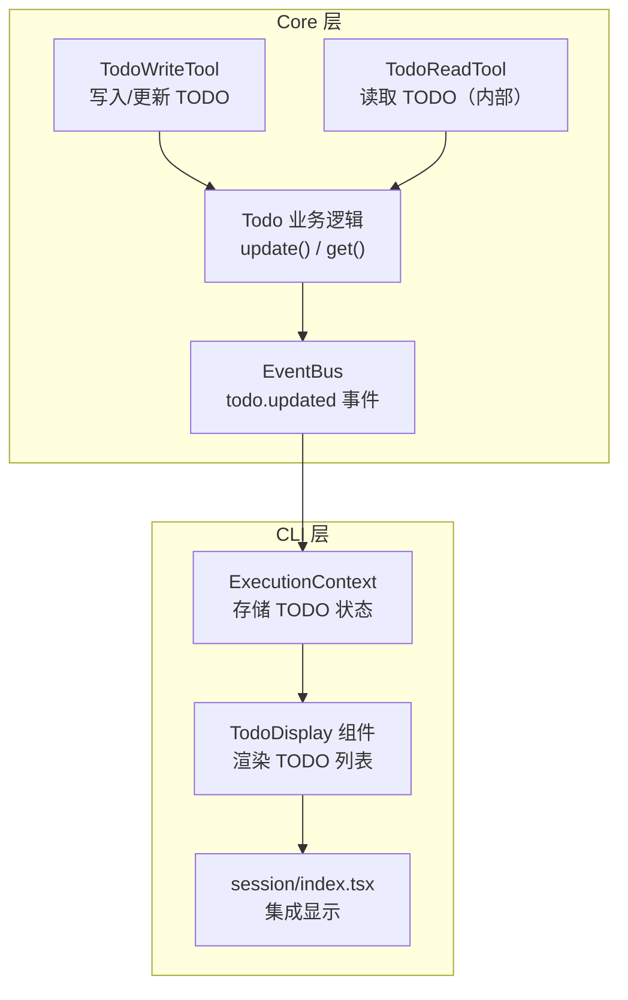

# TODO 工具完整实现计划

## 概述

实现两个 TODO 工具（TodoWrite + TodoRead）用于任务规划和进度跟踪，采用读写分离设计。TODO 列表在 `ExecutionStream` 下方独立显示，使用 Unicode 字符 + 删除线的视觉样式。---

## 架构设计



---

## 实现步骤

### 阶段 1：Core 层 - 工具定义与业务逻辑

**1.1 创建 TODO 数据类型**在 [`packages/core/src/core/tool/Todo/types.ts`](packages/core/src/core/tool/Todo/types.ts) 定义：

```typescript
export interface TodoItem {
  id: string;
  content: string;
  status: 'pending' | 'in_progress' | 'completed' | 'cancelled';
}
```

**1.2 创建 TodoWrite 工具**在 [`packages/core/src/core/tool/Todo/definitions.ts`](packages/core/src/core/tool/Todo/definitions.ts)：

- 参数：`{ todos: TodoItem[], merge?: boolean }`
- 验证：确保只有一个 `in_progress` 状态的任务
- 返回：格式化的 TODO 列表字符串（供 LLM 查看）

**1.3 创建 TodoRead 工具**

- 无参数
- 返回当前 TODO 列表
- 标记为内部工具（UI 不显示）

**1.4 编写工具描述文档**创建 [`packages/core/src/core/tool/Todo/todowrite.txt`](packages/core/src/core/tool/Todo/todowrite.txt)：

- 结合 OpenCode 的详细指导（167 行）
- 结合 gemini-cli 的方法论（7 步）
- 包含正反示例 + reasoning 标签

---

### 阶段 2：CLI 层 - 状态管理与事件订阅

**2.1 扩展 ExecutionContext**在 [`packages/cli/src/context/execution.tsx`](packages/cli/src/context/execution.tsx) 添加：

```typescript
// 新增 TODO 状态
todos: TodoItem[];
setTodos: (todos: TodoItem[]) => void;

// 新增 TODO 显示切换状态
showTodos: boolean;           // 默认 true（显示）
toggleTodos: () => void;      // ctrl+d 切换
```

**2.2 订阅 TODO 更新事件**在 [`packages/cli/src/hooks/useExecutionMessages.ts`](packages/cli/src/hooks/useExecutionMessages.ts) 或新建 hook：

- 监听工具调用结果
- 当 `todowrite` 工具执行成功时，更新 ExecutionContext 中的 todos

---

### 阶段 3：CLI 层 - UI 组件实现

**3.1 创建 TodoDisplay 组件**在 [`packages/cli/src/component/execution/TodoDisplay.tsx`](packages/cli/src/component/execution/TodoDisplay.tsx)：

```typescript
// 视觉效果：
// ☑ 确定旅行天数和整体主题    （绿色 + 删除线）
// ◉ 规划经典必游景点          （黄色高亮）
// ☐ 推荐地道美食体验          （默认颜色）
```

**3.2 集成到 Session 页面**在 [`packages/cli/src/routes/session/index.tsx`](packages/cli/src/routes/session/index.tsx)：

```typescript
{/* ExecutionStream 下方显示 TODO */}
{isExecuting && !isPendingConfirm && (
  <Box marginTop={1} paddingLeft={2} paddingRight={2}>
    <ExecutionStream />
  </Box>
)}

{/* 新增：TODO 列表显示（受 showTodos 控制） */}
{showTodos && todos.length > 0 && (
  <Box paddingLeft={2} paddingRight={2}>
    <TodoDisplay todos={todos} />
  </Box>
)}
```

**3.3 快捷键绑定**在 StatusIndicator 或 Session 组件中添加：

```typescript
useInput((input, key) => {
  if (key.ctrl && input === 'd') {
    toggleTodos();
  }
}, { isActive: isExecuting && todos.length > 0 });
```

**3.4 更新 Tips 提示**在 [`packages/cli/src/component/execution/constants.ts`](packages/cli/src/component/execution/constants.ts) 的 TIPS 数组中添加：

```typescript
'ctrl+d to hide/show todos'
```

---

### 阶段 4：注册工具到 ToolManager

在 [`packages/core/src/core/tool/index.ts`](packages/core/src/core/tool/index.ts) 导出并注册：

- TodoWriteTool
- TodoReadTool

---

## 关键文件清单

| 文件 | 操作 | 说明 ||------|------|------|| `packages/core/src/core/tool/Todo/types.ts` | 新建 | TODO 数据类型 || `packages/core/src/core/tool/Todo/definitions.ts` | 新建 | 工具定义 || `packages/core/src/core/tool/Todo/executors.ts` | 新建 | 执行逻辑 || `packages/core/src/core/tool/Todo/todowrite.txt` | 新建 | 工具描述（长文本） || `packages/core/src/core/tool/index.ts` | 修改 | 导出新工具 || `packages/cli/src/context/execution.tsx` | 修改 | 添加 TODO 状态 || `packages/cli/src/component/execution/TodoDisplay.tsx` | 新建 | TODO 渲染组件 || `packages/cli/src/routes/session/index.tsx` | 修改 | 集成 TODO 显示 |---

## 视觉效果预览

```javascript
┌────────────────────────────────────────────────────────────┐
│ > 帮我规划一次上海旅行                                      │
├────────────────────────────────────────────────────────────┤
│ ⠋ 整理交通出行攻略... (esc to interrupt · 1m 41s · ↓ 2.1k) │
│   └ Tip: ctrl+d to hide todos                              │
│                                                            │
│   ☑ 确定旅行天数和整体主题                                 │
│   ☑ 规划经典必游景点                                       │
│   ☑ 推荐地道美食体验                                       │
│   ☑ 提供住宿区域建议                                       │
│   ◉ 整理交通出行攻略                                       │
│   ☐ 添加购物和娱乐推荐                                     │
├────────────────────────────────────────────────────────────┤
│ > _                                                        │
│                                        ? for shortcuts     │
└────────────────────────────────────────────────────────────┘
```

**隐藏状态时的显示：**

```javascript
┌────────────────────────────────────────────────────────────┐
│ ⠋ 整理交通出行攻略... (esc to interrupt · 1m 41s · ↓ 2.1k) │
│   └ Tip: ctrl+d to show todos                              │
├────────────────────────────────────────────────────────────┤
│ > _                                                        │
└────────────────────────────────────────────────────────────┘
```

---

## 提示词设计要点

结合两个项目的优点：

1. **使用场景判断**（OpenCode）：明确何时使用/不使用
2. **方法论**（gemini-cli）：7 步使用指南