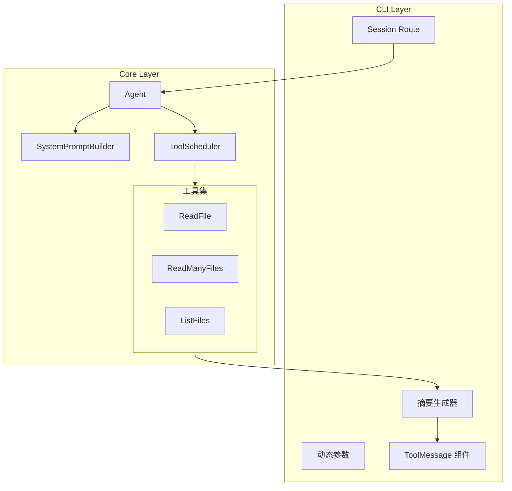

# Agent

系统提示词 + 工具并行 + 批量读取方案

## 一、整体架构



---

## 二、系统提示词设计

### 2.1 新建提示词构建器

创建 [`packages/core/src/core/promptManager/system/systemPromptBuilder.ts`](packages/core/src/core/promptManager/system/systemPromptBuilder.ts)

```typescript
interface SystemPromptContext {
  workingDirectory: string;
  modelName: string;
  osInfo?: string;
  currentDate?: string;
}

export function buildSystemPrompt(context: SystemPromptContext): string;
```


### 2.2 提示词模块（Claude Code 风格）

在 [`packages/core/src/core/promptManager/system/agentPrompts.ts`](packages/core/src/core/promptManager/system/agentPrompts.ts) 中添加：| 模块 | 内容 ||------|------|| ROLE_DEFINITION | 专业编程助手身份 || CORE_CAPABILITIES | 代码理解、问题诊断、代码生成 || TOOL_USAGE_GUIDE | 并行原则 + 批量工具指南 || OUTPUT_STYLE_CONSTRAINTS | 结构化响应、file:line 引用 || INSIGHT_FORMAT_GUIDE | `★ Insight` 教育性洞察格式 |

### 2.3 修改 Agent 类

修改 [`packages/core/src/core/agent/Agent.ts`](packages/core/src/core/agent/Agent.ts)：

- 新增 `SystemPromptContext` 接口
- `init()` 调用 `buildSystemPrompt()` 组装提示词

---

## 三、批量读取工具设计

### 3.1 工具定义

创建 `packages/core/src/core/tool/ReadManyFiles/`：**definitions.ts**

```typescript
export const ReadManyFilesTool: InternalTool = {
  name: 'ReadManyFiles',
  category: 'filesystem',
  description: '批量读取多个文件。支持路径列表或 glob 模式。',
  parameters: {
    type: 'object',
    properties: {
      paths: {
        type: 'array',
        items: { type: 'string' },
        description: '文件路径列表，支持 glob 模式（如 src/**/*.ts）',
      },
      include: { type: 'array', description: '包含模式（可选）' },
      exclude: { type: 'array', description: '排除模式（可选）' },
    },
    required: ['paths'],
  },
  isReadOnly: () => true,
};
```

**executors.ts**

```typescript
interface ReadManyFilesArgs {
  paths: string[];
  include?: string[];
  exclude?: string[];
}

interface ReadManyFilesData {
  files: Array<{
    path: string;
    content: string;
    size: number;
    lineCount: number;
    isTruncated: boolean;
  }>;
  totalFiles: number;
  totalSize: number;
  errors: Array<{ path: string; error: string }>;
}
```


### 3.2 CLI 展示支持（关键）

**1. 参数摘要生成**修改 [`packages/core/src/core/execution/summaryGenerators.ts`](packages/core/src/core/execution/summaryGenerators.ts)：

```typescript
// generateParamsSummary 添加
case 'ReadManyFiles':
  const count = params.paths?.length || 0;
  if (count === 1) {
    return params.paths[0];
  }
  return `${count} files`;
```

**2. 结果摘要生成**

```typescript
// defaultSummaryGenerators 添加
ReadManyFiles: (_, params, result) => {
  if (!result.success) {
    return `Failed: ${result.error}`;
  }
  const data = result.data;
  const fileCount = data?.totalFiles ?? 0;
  const errorCount = data?.errors?.length ?? 0;
  const totalSize = formatSize(data?.totalSize ?? 0);
  
  if (errorCount > 0) {
    return `Read ${fileCount} files (${totalSize}), ${errorCount} errors`;
  }
  return `Read ${fileCount} files (${totalSize})`;
},
```

**3. CLI 展示效果**

```javascript
执行中：
● ReadManyFiles (3 files)
  └ executing...

完成后：
● ReadManyFiles (3 files)
  └ Read 3 files (12.5 KB)

有错误时：
● ReadManyFiles (5 files)
  └ Read 3 files (8.2 KB), 2 errors ⚠️
```


### 3.3 输出格式（给 LLM）

```javascript
=== File: src/api/routes.ts (2.1 KB, 45 lines) ===
[文件内容]

=== File: src/services/user.ts (3.2 KB, 78 lines) ===
[文件内容]

=== Errors ===
- src/missing.ts: File not found

--- Summary ---
Total: 3 files, 12.5 KB
Errors: 1
```

---

## 四、工具并行执行

### 4.1 修改 ToolScheduler

修改 [`packages/core/src/core/tool/ToolScheduler.ts`](packages/core/src/core/tool/ToolScheduler.ts)：

```typescript
async scheduleBatchFromToolCalls(toolCalls, context, options) {
  const canParallel = this.canExecuteInParallel(toolCalls);
  
  if (canParallel && toolCalls.length > 1) {
    logger.info('Executing tools in parallel', { count: toolCalls.length });
    return Promise.all(toolCalls.map(tc => this.schedule(...)));
  }
  // 否则串行执行
}

private canExecuteInParallel(toolCalls): boolean {
  return toolCalls.every(tc => {
    const tool = this.toolManager.getTool(tc.function.name);
    return tool?.isReadOnly?.() ?? false;
  });
}
```

---

## 五、文件变更清单

| 文件 | 操作 | 说明 ||------|------|------|| `core/promptManager/system/systemPromptBuilder.ts` | 新建 | 提示词构建器 || `core/promptManager/system/agentPrompts.ts` | 修改 | 模块化提示词 || `core/promptManager/index.ts` | 修改 | 导出新模块 || `core/agent/Agent.ts` | 修改 | 使用新提示词架构 || `core/tool/ReadManyFiles/definitions.ts` | 新建 | 工具定义 || `core/tool/ReadManyFiles/executors.ts` | 新建 | 执行器 || `core/tool/ReadManyFiles/index.ts` | 新建 | 模块导出 || `core/tool/ToolManager.ts` | 修改 | 注册新工具 || `core/execution/summaryGenerators.ts` | 修改 | 添加 ReadManyFiles 摘要 || `core/tool/ToolScheduler.ts` | 修改 | 并行执行逻辑 |---

## 六、实施顺序

**阶段一：系统提示词重构**

1. 创建提示词模块和构建器
2. 修改 Agent 使用新架构

**阶段二：批量读取工具**

1. 创建 ReadManyFiles 工具（definitions + executors）
2. 添加 CLI 摘要生成器支持
3. 注册到 ToolManager

**阶段三：工具并行执行**

1. 修改 ToolScheduler 添加并行逻辑
2. 添加日志记录

**阶段四：测试验证**

1. 验证提示词输出效果