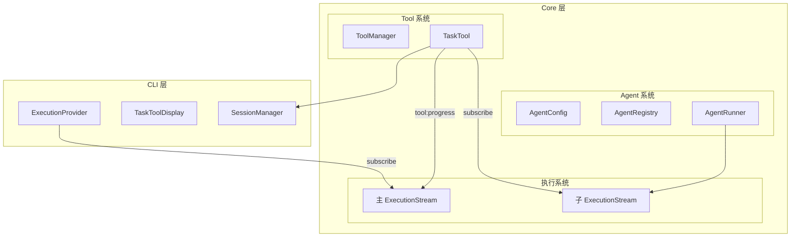

# reason-code 子代理系统实现文档

## 一、需求概述

### 1.1 目标

实现类似 Claude Code / OpenCode 的子代理系统，让主代理可以通过 `task` 工具调用专门的子代理（如 `explore`）来处理特定任务。

### 1.2 核心特性

- **配置驱动**：通过 AgentConfig 定义代理行为，AgentRunner 通用执行
- **工具隔离**：子代理只能使用受限的工具集，不能调用 `task`（防止递归）
- **会话隔离**：子代理使用独立的上下文，不污染主会话
- **实时显示**：子代理的工具调用过程实时显示在 CLI 中
- **会话持久化**：子会话也持久化到磁盘，支持查看历史

### 1.3 架构图



---

## 二、模块设计

### 2.1 AgentConfig 类型系统

**文件**：`packages/core/src/core/agent/config/types.ts`

定义代理配置的类型基础：

```typescript
/** 代理模式 */
export type AgentMode = 'primary' | 'subagent' | 'all';

/** 代理配置 */
export interface AgentConfig {
  /** 唯一标识 */
  name: string;
  
  /** 模式 */
  mode: AgentMode;
  
  /** 描述（用于 Task 工具说明） */
  description: string;
  
  /** 自定义系统提示词 */
  systemPrompt?: string;
  
  /** 工具配置：false = 禁用 */
  tools?: Record<string, boolean>;
  
  /** 模型配置（可选，覆盖默认） */
  model?: {
    provider: string;
    model: string;
  };
  
  /** 执行配置 */
  execution?: {
    maxLoops?: number;
    enableCompression?: boolean;
  };
  
  /** 是否隐藏（不在 UI 显示） */
  hidden?: boolean;
}
```

**预设配置**：

- `build`：主代理，通用编程代理，使用默认系统提示词和所有工具
- `explore`：子代理，代码库探索专家，只读权限，禁用 `write_file` 和 `todo_write`

### 2.2 AgentRegistry 注册表

**文件**：`packages/core/src/core/agent/registry.ts`

集中管理所有代理配置的单例：

```typescript
export class AgentRegistry {
  private agents: Map<string, AgentConfig> = new Map();
  
  /** 注册代理 */
  register(config: AgentConfig): void;
  
  /** 获取代理配置 */
  get(name: string): AgentConfig | undefined;
  
  /** 获取主代理列表（用于 UI 切换） */
  getPrimaryAgents(): AgentConfig[];
  
  /** 获取子代理列表（用于 Task 工具） */
  getSubAgents(): AgentConfig[];
}

// 单例导出
export const agentRegistry = new AgentRegistry();
```

### 2.3 ToolManager 扩展

**文件**：`packages/core/src/core/tool/ToolManager.ts`

新增方法支持按代理配置过滤工具：

```typescript
export class ToolManager {
  /** 注册单个工具（动态注册） */
  register(tool: InternalTool): void;
  
  /**
   * 获取指定代理可用的工具（过滤版）
   * @param agentConfig - 代理配置
   * @param excludeTask - 是否排除 task 工具（子代理必须排除）
   */
  getFilteredTools(agentConfig: AgentConfig, excludeTask = false): InternalTool[];
  
  /** 获取过滤后的 OpenAI 格式工具 */
  getFormattedToolsFor(agentConfig: AgentConfig, excludeTask = false): OpenAITool[];
}
```

### 2.4 ExecutionStream 扩展

**文件**：
- `packages/core/src/core/execution/types.ts`
- `packages/core/src/core/execution/events.ts`
- `packages/core/src/core/execution/ExecutionStreamManager.ts`

新增子代理进度相关类型和事件：

```typescript
// types.ts

/** 子代理工具进度类型 */
export type SubAgentProgressType = 'tool_start' | 'tool_complete' | 'thinking';

/** 子代理工具进度信息 */
export interface SubAgentProgress {
  type: SubAgentProgressType;
  subToolCallId: string;
  toolName: string;
  paramsSummary?: string;
  status: 'running' | 'completed' | 'error';
  resultSummary?: string;
  error?: string;
}

/** 子代理工具摘要（用于显示） */
export interface SubAgentToolSummary {
  id: string;
  tool: string;
  status: 'running' | 'completed' | 'error';
  title?: string;
}
```

```typescript
// events.ts - 新增事件

| {
    type: 'tool:progress';
    /** 父工具调用 ID（TaskTool 的 callId） */
    toolCallId: string;
    /** 子代理进度信息 */
    progress: SubAgentProgress;
  }
```

```typescript
// ExecutionStreamManager.ts - 新增方法

/**
 * 发送工具进度事件（用于 task 工具的子代理进度）
 */
emitToolProgress(toolCallId: string, progress: SubAgentProgress): void;
```

### 2.5 SessionManager 会话管理

**文件**：`packages/cli/src/services/SessionManager.ts`

CLI 层会话管理服务，支持父子会话：

```typescript
class SessionManagerImpl {
  /** 创建会话（主会话或子会话） */
  createSession(options: CreateSessionOptions = {}): Session;
  
  /** 获取会话 */
  getSession(sessionId: string): Session | null;
  
  /** 获取子会话列表 */
  getChildSessions(options: { parentId: string }): Session[];
  
  /** 复用或创建子会话（TaskTool 调用） */
  getOrCreateSubSession(options: {
    sessionId?: string;
    parentId: string;
    agentName: string;
    title?: string;
  }): Session;
  
  /** 列出所有主会话（过滤子会话） */
  listMainSessions(): Session[];
  
  /** 删除会话（包括其所有子会话） */
  deleteSessionWithChildren(sessionId: string): void;
}

export const SessionManager = new SessionManagerImpl();
```

**Session 类型扩展**（`packages/cli/src/context/store.tsx`）：

```typescript
export interface Session {
  id: string;
  title: string;
  createdAt: number;
  updatedAt: number;
  
  // 子代理会话相关字段
  parentId?: string;      // 父会话 ID（子会话专用）
  agentName?: string;     // 使用的代理名称
  isSubSession?: boolean; // 是否为子会话（便于过滤）
}
```

### 2.6 AgentRunner 执行器

**文件**：`packages/core/src/core/agent/runner/AgentRunner.ts`

通用代理执行器，支持主代理和子代理：

```typescript
export class AgentRunner extends EventEmitter {
  constructor(options: AgentRunnerConstructorOptions);
  
  /**
   * 执行代理
   * @param input - 用户输入
   * @param options - 运行选项
   */
  async run(input: string, options: AgentRunnerOptions): Promise<AgentRunnerResult>;
}
```

**核心执行流程**：

1. 创建独立的 ContextManager（上下文隔离）
2. 设置系统提示词（使用代理配置或默认）
3. 创建 LLM 服务
4. 获取过滤后的工具（子代理排除 task）
5. 创建临时 ToolManager（只包含允许的工具）
6. 执行工具循环

### 2.7 TaskTool 实现

**文件**：`packages/core/src/core/tool/Task/`

Task 工具连接主代理和子代理：

```typescript
// types.ts
export interface TaskParams {
  description: string;    // 任务描述（3-5 个词）
  prompt: string;         // 详细任务说明
  subagent_type: string;  // 子代理类型
  session_id?: string;    // 可选：继续之前的会话
}

export interface TaskResult {
  success: boolean;
  output: string;
  metadata: {
    agentName: string;
    sessionId: string;
    summary: SubAgentToolSummary[];
  };
}
```

**执行流程**（`executors.ts`）：

1. 获取代理配置（从 AgentRegistry）
2. 创建或获取子会话（通过 SessionManager）
3. 创建子代理的 ExecutionStream
4. 订阅子代理事件，转发为 `tool:progress`
5. 创建 AgentRunner 并执行
6. 返回结果

**事件转发机制**：

```typescript
subExecStream.on((event) => {
  if (event.type === 'tool:validating') {
    // 子工具开始 → 发送 tool:progress (tool_start)
    context.executionStream.emitToolProgress(context.callId, {
      type: 'tool_start',
      subToolCallId: event.toolCall.id,
      toolName: event.toolCall.toolName,
      status: 'running',
    });
  }
  
  if (event.type === 'tool:complete') {
    // 子工具完成 → 发送 tool:progress (tool_complete)
    context.executionStream.emitToolProgress(context.callId, {
      type: 'tool_complete',
      subToolCallId: event.toolCall.id,
      toolName: event.toolCall.toolName,
      status: event.toolCall.status === 'success' ? 'completed' : 'error',
      resultSummary: event.toolCall.resultSummary,
    });
  }
});
```

---

## 三、CLI 层集成

### 3.1 事件处理

**文件**：`packages/cli/src/hooks/useExecutionMessages.ts`

处理 `tool:progress` 事件，更新工具消息的子代理摘要：

```typescript
case 'tool:progress': {
  const { toolCallId, progress } = event;
  const messageId = toolMessageMapRef.current.get(toolCallId);
  
  const currentSummary = currentMessage.toolCall.subAgentSummary || [];
  let newSummary;
  
  if (progress.type === 'tool_start') {
    // 添加新的子工具
    newSummary = [...currentSummary, {
      id: progress.subToolCallId,
      tool: progress.toolName,
      status: 'running',
    }];
  } else if (progress.type === 'tool_complete') {
    // 更新子工具状态
    newSummary = currentSummary.map(item =>
      item.id === progress.subToolCallId
        ? { ...item, status: progress.status, title: progress.resultSummary }
        : item
    );
  }
  
  updateMessage(sessionId, messageId, {
    toolCall: { subAgentSummary: newSummary },
  });
  break;
}
```

### 3.2 TaskToolMessage 显示组件

**文件**：`packages/cli/src/component/message-area/task-tool-message.tsx`

专用于显示 task 工具的执行状态，包括子代理工具调用列表：

```
◉ task (explore codebase)
├ ● Glob → Found 15 files
├ ● ReadFile → Read package.json
├ ⠋ Grep (searching...)
└ ...
```

**特性**：
- 动态 Spinner 动画显示执行中状态
- 最多显示最新 5 个子工具调用
- 折叠显示更多工具调用（`+N more tool uses`）
- 树形结构显示（`├` 和 `└` 前缀）

### 3.3 初始化集成

**文件**：`packages/cli/src/hooks/useAgent.ts`

在 Agent 初始化时初始化 TaskTool：

```typescript
// 初始化 TaskTool（子代理支持）
if (!isTaskToolInitialized()) {
  initTaskTool(
    {
      getOrCreateSubSession: (options) => SessionManager.getOrCreateSubSession(options),
      defaultModel: { provider, model },
      apiKey: providerConfig.apiKey,
      baseURL: providerConfig.baseUrl,
    },
    agent.getToolManager()
  );
}
```

---

## 四、文件清单

### 新增文件

| 模块 | 文件路径 | 说明 |
|------|----------|------|
| AgentConfig | `core/agent/config/types.ts` | 代理配置类型 |
| AgentConfig | `core/agent/config/presets/build.ts` | 主代理预设 |
| AgentConfig | `core/agent/config/presets/explore.ts` | 子代理预设 |
| AgentConfig | `core/agent/config/presets/index.ts` | 预设导出 |
| AgentConfig | `core/agent/config/index.ts` | 配置模块导出 |
| AgentRegistry | `core/agent/registry.ts` | 代理注册表 |
| AgentRunner | `core/agent/runner/types.ts` | 执行器类型 |
| AgentRunner | `core/agent/runner/AgentRunner.ts` | 执行器实现 |
| AgentRunner | `core/agent/runner/index.ts` | 执行器导出 |
| TaskTool | `core/tool/Task/types.ts` | Task 工具类型 |
| TaskTool | `core/tool/Task/definitions.ts` | Task 工具定义 |
| TaskTool | `core/tool/Task/executors.ts` | Task 工具执行器 |
| TaskTool | `core/tool/Task/index.ts` | Task 模块导出 |
| SessionManager | `cli/src/services/SessionManager.ts` | 会话管理服务 |
| SessionManager | `cli/src/services/index.ts` | 服务模块导出 |
| TaskToolMessage | `cli/src/component/message-area/task-tool-message.tsx` | Task 工具显示组件 |

### 修改文件

| 模块 | 文件路径 | 修改内容 |
|------|----------|----------|
| Agent | `core/agent/index.ts` | 导出新模块 |
| ToolManager | `core/tool/ToolManager.ts` | 添加 `getFilteredTools`、`register` |
| Tool | `core/tool/index.ts` | 导出 TaskTool |
| Execution | `core/execution/types.ts` | 添加子代理进度类型 |
| Execution | `core/execution/events.ts` | 添加 `tool:progress` 事件 |
| Execution | `core/execution/ExecutionStreamManager.ts` | 添加 `emitToolProgress` |
| Store | `cli/src/context/store.tsx` | 扩展 Session 和 ToolCallInfo |
| Hook | `cli/src/hooks/useExecutionMessages.ts` | 处理 `tool:progress` 事件 |
| Hook | `cli/src/hooks/useAgent.ts` | 初始化 TaskTool |
| Component | `cli/src/component/message-area/tool-message.tsx` | 集成 TaskToolMessage |

---

## 五、使用示例

### 5.1 LLM 调用 Task 工具

当主代理需要探索代码库时，会调用 task 工具：

```json
{
  "name": "task",
  "arguments": {
    "description": "Explore authentication flow",
    "prompt": "Find and analyze the authentication implementation in this codebase. Look for login, logout, session management, and token handling code.",
    "subagent_type": "explore"
  }
}
```

### 5.2 CLI 显示效果

```
◉ task (Explore authentication flow)
├ ● Glob → Found 23 files matching **/auth/**
├ ● ReadFile → Read src/auth/login.ts (245 lines)
├ ● Grep → Found 12 matches for "session"
├ ⠋ ReadFile (reading...)
```

### 5.3 添加新的子代理

在 `packages/core/src/core/agent/config/presets/` 下创建新文件：

```typescript
// reviewer.ts
export const reviewerAgent: AgentConfig = {
  name: 'reviewer',
  mode: 'subagent',
  description: 'Code review specialist for analyzing code quality and suggesting improvements',
  systemPrompt: `You are a code review specialist...`,
  tools: {
    write_file: false,  // 只读
  },
  execution: {
    maxLoops: 30,
  },
};
```

然后在 `presets/index.ts` 导出，并在 `registry.ts` 中注册。

---

## 六、未来扩展

### 6.1 用户自定义子代理

计划支持用户在配置目录下创建自定义子代理：

```
~/.reason-code/
├── config.json
└── agents/
    ├── researcher.json
    └── reviewer.json
```

### 6.2 子代理会话复用

通过 `session_id` 参数继续之前的子代理会话：

```json
{
  "name": "task",
  "arguments": {
    "description": "Continue exploration",
    "prompt": "Based on what you found earlier, now look at the database models.",
    "subagent_type": "explore",
    "session_id": "sub-session-123"
  }
}
```

### 6.3 多级子代理

未来可能支持子代理调用其他子代理（需要谨慎设计递归深度限制）。

---

## 七、设计决策记录

### 7.1 为什么会话管理在 CLI 层？

- 现有会话存储（`storage.ts`）已在 CLI 层
- Zustand Store 管理运行时状态
- CLI 负责 UI 过滤（主会话 vs 子会话）
- 保持 Core 层的纯粹性

### 7.2 为什么使用事件转发而非 CLI 直接订阅子代理？

- **方案 A（采用）**：TaskTool 订阅子代理事件 → 转发为 `tool:progress` → CLI 只订阅主代理
- **方案 B（放弃）**：CLI 同时订阅主代理和子代理

选择方案 A 的原因：
- CLI 逻辑简单，只需订阅一个 ExecutionStream
- 子代理的生命周期完全由 TaskTool 管理
- 更容易扩展（如多个子代理并行执行）

### 7.3 为什么子代理排除 task 工具？

防止递归调用导致：
- 无限循环
- 资源耗尽
- 难以追踪的执行路径

---

*文档版本：1.0.0*
*最后更新：2026-01-15*


