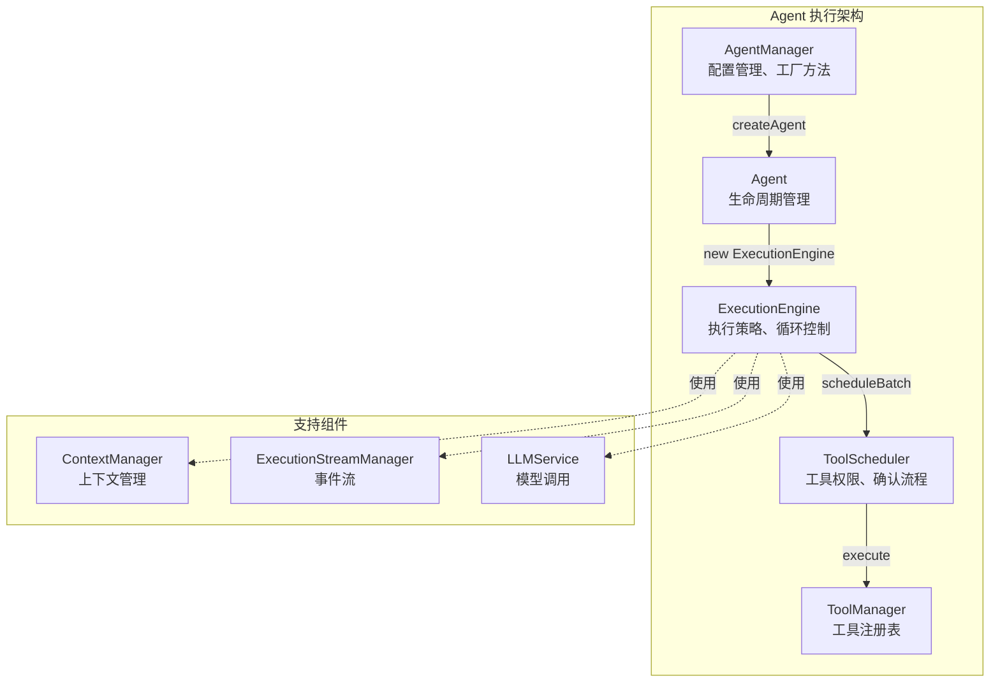
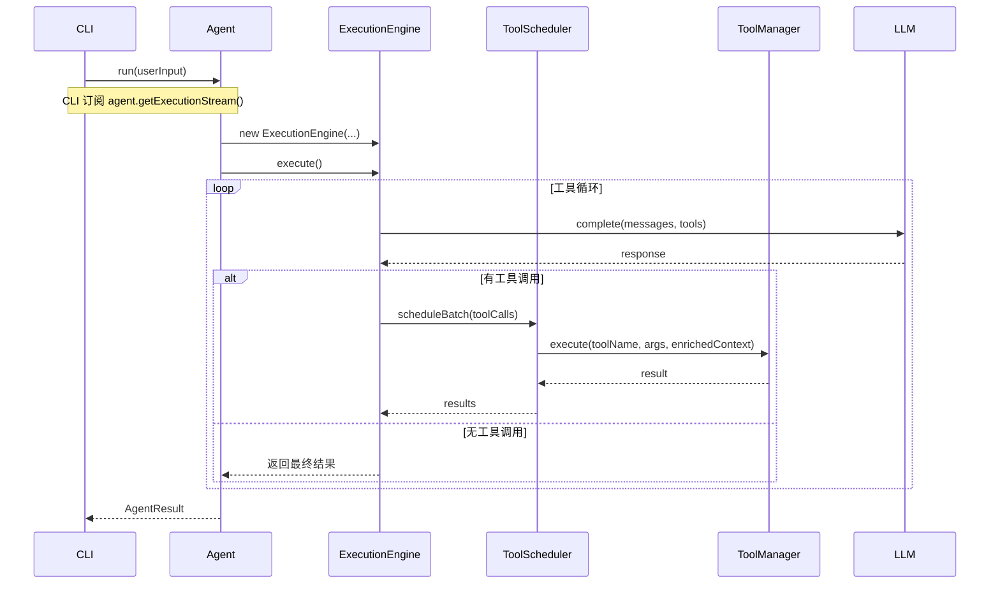
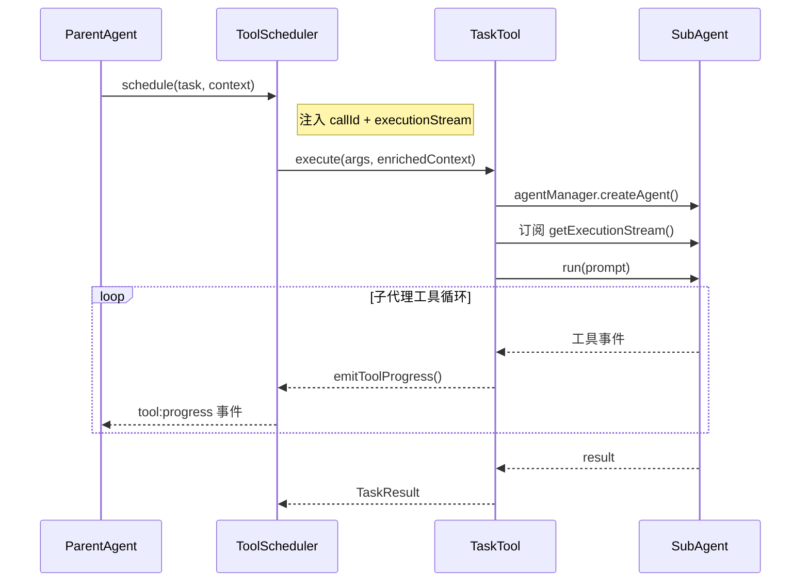

# Agent 执行架构

本文档说明 Agent 执行系统的整体架构、各层职责和调用流程。

## 架构概览

```
AgentManager - 工厂层，配置管理
└── Agent - 生命周期层
    └── ExecutionEngine - 执行层（原 ToolLoopExecutor）
        └── ToolScheduler - 调度层
            └── ToolManager - 注册层
```

## 架构图



## 各层职责

### 1. AgentManager（工厂层）

**文件位置**: `packages/core/src/core/agent/AgentManager.ts`

**职责**:
- 管理多个 Agent 配置（预设）
- 提供工厂方法创建 Agent 实例
- 管理共享运行时（apiKey、baseURL、toolManager）
- 延迟初始化 ToolManager（避免循环依赖）

**主要方法**:
- `register(config)` - 注册 Agent 配置
- `createAgent(name)` - 创建 Agent 实例
- `configure(options)` - 配置运行时参数
- `listSubAgents()` - 列出可用子代理

### 2. Agent（生命周期层）

**文件位置**: `packages/core/src/core/agent/Agent.ts`

**职责**:
- 初始化和配置管理（`init`、`setModel`）
- 生命周期控制（`run`、`abort`）
- ExecutionStream 持有者
- 状态查询（`getTokenUsage`、`getSessionStats`）
- 历史加载（`loadHistory`、`initWithCheckpoint`）

**主要方法**:
- `init(options)` - 初始化 Agent
- `run(userInput, options)` - 执行 Agent
- `abort()` - 中断执行
- `getExecutionStream()` - 获取事件流（供 CLI 订阅）

### 3. ExecutionEngine（执行层）

**文件位置**: `packages/core/src/core/agent/execution/ExecutionEngine.ts`

**职责**:
- 执行策略实现（循环执行）
- LLM 调用循环管理
- 工具调用协调
- 上下文压缩管理
- 溢出检测和中断控制

**主要方法**:
- `execute()` - 执行工具循环（主入口）
- `executeIteration()` - 执行单次迭代
- `handleToolCalls()` - 处理工具调用
- `checkOverflow()` - 溢出检查

**注意**: 此类原名 `ToolLoopExecutor`，已重命名为 `ExecutionEngine` 以更好地表达职责。

### 4. ToolScheduler（调度层）

**文件位置**: `packages/core/src/core/tool/ToolScheduler.ts`

**职责**:
- 工具权限验证
- 用户确认流程（需要确认的操作）
- 工具执行调度
- 并行/串行执行策略
- 工具输出总结
- 向 context 注入 `callId` 和 `executionStream`（供子代理使用）

**主要方法**:
- `schedule(request, context)` - 调度单个工具调用
- `scheduleBatchFromToolCalls(toolCalls, context)` - 批量调度
- `setApprovalMode(mode)` - 设置批准模式

### 5. ToolManager（注册层）

**文件位置**: `packages/core/src/core/tool/ToolManager.ts`

**职责**:
- 工具注册表管理
- 工具查找
- 工具执行
- 工具定义格式化（OpenAI 格式）

**主要方法**:
- `register(tool)` - 注册工具
- `getTool(name)` - 获取工具
- `execute(name, args, context)` - 执行工具
- `getFormattedTools()` - 获取 OpenAI 格式工具列表

## 调用流程

### 主流程



### 子代理流程（TaskTool）



## ExecutionStream 事件流

每个 Agent 实例持有自己的 `ExecutionStreamManager`，用于向 CLI 层发送执行状态事件。

### 主要事件类型

| 事件 | 说明 |
|------|------|
| `execution:start` | 执行开始 |
| `execution:complete` | 执行完成 |
| `execution:error` | 执行错误 |
| `execution:cancel` | 执行取消 |
| `thinking:start/delta/complete` | 思考过程 |
| `tool:validating` | 工具验证中 |
| `tool:executing` | 工具执行中 |
| `tool:complete` | 工具完成 |
| `tool:progress` | 子代理进度（TaskTool 专用） |

### CLI 订阅方式

```typescript
const agent = agentManager.createAgent('build');
await agent.init();

// 订阅事件流
const unsubscribe = agent.getExecutionStream().on((event) => {
  // 处理事件，更新 UI
});

// 执行
const result = await agent.run(userInput);

// 清理
unsubscribe();
```

## 设计原则

1. **单一职责**: 每一层只负责特定的功能
2. **依赖注入**: 通过构造函数注入依赖，便于测试
3. **事件驱动**: 通过 ExecutionStream 解耦执行层和 UI 层
4. **向后兼容**: 保留 `ToolLoopExecutor` 别名，支持旧代码

## 文件结构

```
packages/core/src/core/
├── agent/
│   ├── Agent.ts              # Agent 类
│   ├── AgentManager.ts       # Agent 工厂
│   ├── execution/
│   │   ├── ExecutionEngine.ts  # 执行引擎（原 ToolLoopExecutor）
│   │   └── index.ts
│   ├── config/
│   │   └── ...               # Agent 配置预设
│   └── index.ts
├── tool/
│   ├── ToolManager.ts        # 工具管理器
│   ├── ToolScheduler.ts      # 工具调度器
│   └── Task/
│       ├── definitions.ts    # TaskTool 定义
│       └── executors.ts      # TaskTool 执行器
├── execution/
│   └── ExecutionStreamManager.ts  # 事件流管理
└── llm/
    └── ...                   # LLM 服务
```
